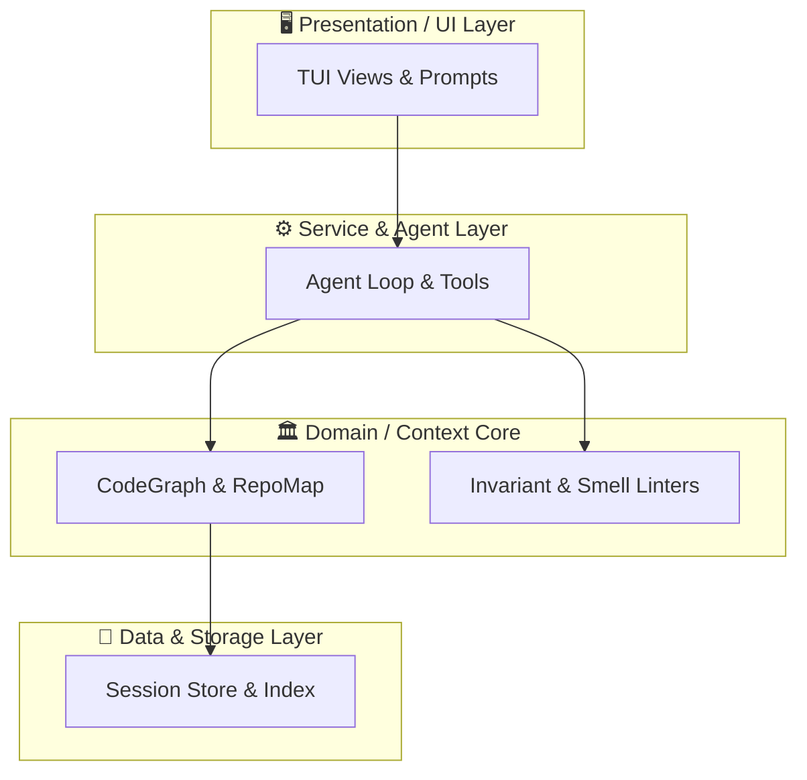

# 🏛️ Architecture Documentation: minicode

> *Automatically synthesized by `minicode` AST & CodeGraph Engine*

## 📊 System Overview
- **Workspace Root:** `/home/aswin/programming/vscode/myProjects/ai_agent_tools/minicode`
- **Total Source Files:** 387
- **Total Analyzed Symbols:** 3897

## 📐 Clean Architecture Layer Breakdown

| Layer | File Count | Primary Components |
| :--- | :--- | :--- |
| **API & Protocols** | 3 | `src/main.rs, src/lsp/protocol.rs, src/mcp/server.rs` |
| **Core Services & Agent** | 302 | `tests/integration_tool_middleware.rs, tests/integration_doc_crawler.rs, +300 more` |
| **Data & Persistence** | 16 | `src/context/graph/graph.rs, src/context/memory/episodic.rs, +14 more` |
| **UI & Presentation** | 53 | `src/tools/minikit/templates/builtin/static_website.rs, src/tools/minikit/templates/builtin/mern.rs, +51 more` |
| **Utilities & Support** | 13 | `tests/common/mock_provider.rs, tests/common/workspace.rs, +11 more` |

## 🗺️ Architectural Component & Data Flow

## 🔑 Core High-Centrality Symbols (PageRank)

| Symbol | Kind | Centrality (PageRank) |
| :--- | :--- | :--- |
| `path` | `Function` | `0.0538` |
| `path` | `Function` | `0.0538` |
| `workspace_root` | `Function` | `0.0102` |
| `all` | `Function` | `0.0079` |
| `all` | `Function` | `0.0076` |
| `all` | `Function` | `0.0076` |
| `all` | `Function` | `0.0076` |
| `SettingsTab` | `Impl` | `0.0069` |
| `VerificationBarrier` | `Impl` | `0.0064` |
| `status` | `Function` | `0.0054` |

