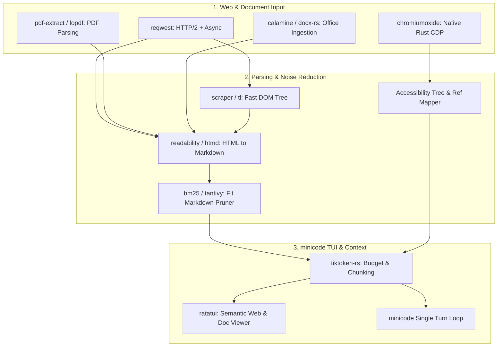

# Research: Browser Automation, Web Scraping, and Content Extraction for minicode

> **Document Context**: Technical evaluation of state-of-the-art browser automation tools, web scrapers, and content extraction frameworks for `minicode` — a fast, minimalist TUI + CLI AI coding agent written in Pure Rust (`tokio`, `ratatui`, `reqwest`, `tree-sitter`, `petgraph`, `tiktoken-rs`, `serde`, `clap`, `similar`).
>
> **Target Path**: `research/for_browser_and_scraping.md`

---

## Executive Summary

Modern AI coding agents require web access for three core operational needs:
1. **Zero-overhead HTTP Document Extraction**: Rapidly fetching API references, documentation, package info, and GitHub issues without spawning heavy headless browser instances or wasting context window tokens on boilerplate HTML/navbars.
2. **Deterministic Browser Automation (CDP)**: Driving interactive web applications, testing locally running dev servers (`localhost:3000`), taking screenshots/annotated visual snapshots, and filling forms using accessibility trees rather than token-heavy screenshots.
3. **Structured & Multi-Format Ingestion**: Converting non-text formats (PDFs, raw HTML, office docs, repos) into clean, token-efficient, LLM-friendly Markdown with semantic structural integrity (tables, headings, links, citations).

This report analyzes 12 leading projects across these domains, identifies key architectural patterns, catalogs relevant Rust crates, and concludes with the top 5 actionable recommendations for `minicode`.

---

## Deep-Dive Repository Analysis

---

### 1. Agent Browser
- **URL**: [https://github.com/vercel-labs/agent-browser](https://github.com/vercel-labs/agent-browser)
- **What It Does**: A fast native Rust CLI and daemon for AI agent browser automation via Chrome DevTools Protocol (CDP), featuring an accessibility snapshot ref system and smart Markdown reading.

#### Key Technical Highlights
- **Daemon Architecture**: Automatically manages a background Chromium daemon process to eliminate per-command startup latency. Single CLI commands (`agent-browser click @e2`) communicate with the daemon over local IPC / CDP.
- **Accessibility Tree Ref System**: Instead of relying on CSS selectors or vision LLMs, `agent-browser snapshot` produces a clean ARIA accessibility tree with numbered element references (e.g., `@e1`, `@e2`, `@e3`). Subsequent commands interact directly with these refs (`click @e2`, `fill @e3 "query"`).
- **Smart `read` Subcommand (Zero-Browser HTTP Fetcher)**:
  - Fetches URLs without launching Chrome.
  - Sends `Accept: text/markdown` by default.
  - Falls back to `.md` URL extension probing if the server provides standard HTML.
  - Walks ancestor directories looking for `/llms.txt` and `/llms-full.txt` hierarchy.
  - Generates compact outline views (`--outline`) and filtered sections (`--filter`).
- **Semantic Locators**: Supports ARIA role-based resolution (`find role button click --name "Submit"`), label matching, placeholder matching, and exact text search.
- **Batch Execution**: Supports executing command sequences in a single turn via JSON arrays or quoted arguments (`batch "open url" "snapshot" "screenshot"`), eliminating turn-by-turn roundtrips.
- **React & DevTools Hooks**: Built-in React Fiber tree inspection and Web Vitals recording.

#### Inspiration for minicode
- **Zero-Browser `read` tool**: Implement a lightweight `web_fetch` tool in `minicode` that does HTTP content negotiation (`Accept: text/markdown`), probes for `llms.txt` or `.md` endpoints, and converts HTML into compact Markdown with heading outlines.
- **Numbered Ref Snapshots**: For web automation tools, exposing numbered refs (`@e1`, `@e2`) from an accessibility tree is exponentially more token-efficient and deterministic than vision screenshots or raw HTML DOMs.
- **Command Batching**: Allow `minicode` to batch browser operations into a single execution step to minimize LLM tool-calling roundtrips.

#### Rust Crates / Dependencies Worth Noting
- `chromiumoxide` / `headless_chrome` (CDP client in Rust)
- `tokio` (Async runtime for daemon and WebSocket CDP connections)
- `clap` (Fast CLI parsing with subcommands)
- `scraper` / `lol_html` (Fast HTML parsing and text extraction)
- `serde_json` (CDP protocol messaging and batch JSON parsing)

---

### 2. GSD Browser
- **URL**: [https://github.com/open-gsd/gsd-browser](https://github.com/open-gsd/gsd-browser)
- **What It Does**: A native Rust browser automation CLI and Model Context Protocol (MCP) server exposing 90+ commands and 50+ agent tools over CDP with versioned refs, live interactive workbench, and recording bundles.

#### Key Technical Highlights
- **Rust Native Implementation**: Built from scratch in Rust with a clean modular workspace (`cli`, `common`, `gsd-browser-skill`).
- **Standardized High-Value Response Envelopes**: Every tool call returns structured envelopes consisting of:
  - `summary`: Human/agent-readable status.
  - `structured_data`: Precise machine-readable payload.
  - `suggested_next_actions`: Contextual hints for what the agent should execute next.
  - `evidence_refs`: Pointers to screenshots, traces, and HAR recordings.
- **Versioned Element References (`@v1:e1`)**: Binds element IDs to snapshot revision counters. If the DOM mutates between turns, stale refs fail fast instead of misclicking unexpected elements.
- **Interactive Live Workbench & Human Takeover**: Exposes a local authenticated streaming workbench (`gsd-browser view`) enabling human operators to view live browser frames, draw annotations, pause/resume agent execution, or take over control during sensitive flows (CAPTCHA, 2FA).
- **Security & Safety Guardrails**: Built-in prompt injection scanning, sensitive-mode redaction, and action caching for self-healing flows.

#### Inspiration for minicode
- **Versioned Snapshot Refs**: Prevent hallucinated or stale element clicks by associating refs with snapshot revision IDs.
- **Suggested Next Actions in Tool Output**: Enhances agent planning by providing actionable hints in tool return payloads.
- **Interactive TUI / Live Stream Integration**: Connects nicely with `minicode`'s TUI philosophy — allowing users to watch agent browser execution in real-time or intervene when stuck.

#### Rust Crates / Dependencies Worth Noting
- `tokio` / `tokio-tungstenite` (Async WebSocket communication with CDP)
- `axum` / `tower-http` (Serving local workbench and streamable HTTP MCP server)
- `serde` / `serde_json` (Protocol serialization)
- `tracing` / `tracing-subscriber` (Diagnostics and timeline recording)
- `image` / `imageproc` (Visual diffing and screenshot handling)

---

### 3. Chromewright
- **URL**: [https://github.com/bnomei/chromewright](https://github.com/bnomei/chromewright)
- **What It Does**: A local-first Rust browser automation MCP server and semantic terminal browser (TUI) built on CDP with Vimari-style navigation and co-hosted MCP companions.

#### Key Technical Highlights
- **Pure Rust Native Architecture**: Forked and evolved from `browser-use-rs`, targeting Rust 1.88+ with zero Node.js runtime dependencies.
- **Semantic Terminal Browser (TUI)**:
  - Built-in terminal browser (`chromewright tui`) that attaches to existing or headless Chrome instances.
  - Renders semantic DOM directly in the terminal (headers, paragraphs, lists, links, form inputs) rather than rendering pixels or CSS layout.
  - Vimari-style keymap: `f` / `s` for two-letter link hint overlays, `j`/`k` for block scrolling, `gi` for focusing first input.
- **Co-Hosted MCP Companion**: When the TUI runs, it co-hosts a loopback MCP server allowing external AI agents to read the user's active document state, current selection, and DOM revision.
- **Revision-Scoped Handles & Markdown Pagination**: Retains the last 8 document revisions; paginates large extracted Markdown documents at 32,000 characters (up to 200,000 max) to prevent context window saturation.

#### Inspiration for minicode
- **Direct TUI Integration**: Since `minicode` is built on `ratatui`, embedding a semantic DOM / Markdown web viewer directly inside `minicode`'s TUI enables seamless documentation browsing without leaving the terminal.
- **Vim-Style Hint Mode**: Link hint navigation (`f` -> `AB` to follow link) can be adapted for keyboard-driven link extraction and terminal reading.
- **Markdown Pagination Guards**: Hard limits and paginated chunking (32k char slices) protect `minicode`'s LLM context window from massive web pages.

#### Rust Crates / Dependencies Worth Noting
- `ratatui` & `crossterm` (Semantic terminal UI rendering and key event handling)
- `chromiumoxide` (CDP client)
- `reqwest` (HTTP requests and DevTools discovery)
- `tokio` (Async runtime)

---

### 4. Crawl4AI
- **URL**: [https://github.com/unclecode/crawl4ai](https://github.com/unclecode/crawl4ai)
- **What It Does**: An open-source, LLM-friendly web crawler and scraper focused on converting messy web pages into clean, token-efficient, structured Markdown.

#### Key Technical Highlights
- **"Clean Markdown" vs. "Fit Markdown"**:
  - *Clean Markdown*: High-fidelity structural Markdown conversion preserving headers, tables, code blocks, and links.
  - *Fit Markdown*: Heuristic and algorithmic noise reduction designed specifically to minimize LLM token consumption by stripping boilerplate, navbars, sidebars, copyright footers, and advertising copy.
- **Pruning & BM25 Content Filtering**:
  - `PruningContentFilter`: Uses text-to-tag ratios and tree density to discard low-value boilerplate.
  - `BM25ContentFilter`: Ranks and extracts only document sections relevant to a user query or agent prompt.
  - Preserves essential semantic tags/classes (`preserve_tags`, `preserve_classes`) for author metadata, timestamps, and code blocks.
- **Shadow DOM Flattening**: Automatically pierces and flattens Web Component Shadow DOMs into the main document tree.
- **Adaptive Concurrency & Memory Dispatcher**: `MemoryAdaptiveDispatcher` throttles and manages page pools based on real-time system memory pressure.
- **Multi-Strategy Schema Extraction**: Combines CSS/XPath selector schemas (`JsonCssExtractionStrategy`) with LLM-based structured extraction (`LLMExtractionStrategy`).

#### Inspiration for minicode
- **Fit Markdown Filter Algorithm**: Implement an in-memory content pruner in Rust (using text density heuristics or BM25 query filtering) to compress 10,000-word HTML pages into 1,000-word high-density Markdown extracts before feeding them to `minicode`'s context.
- **Shadow DOM Flattening**: Crucial when scraping modern documentation sites built with Web Components or nested frames.
- **Numbered Citation Lists**: Converting inline hyperlinks into a footnote reference index at the bottom of extracted Markdown keeps the text readable and saves tokens.

#### Rust Crates / Dependencies Worth Noting (Rust Alternatives)
- `html2md` / `htmd` (HTML to Markdown conversion in Rust)
- `scraper` / `tl` (Fast HTML parser and DOM traversal)
- `bm25` / `tantivy` (BM25 ranking and full-text filtering in Pure Rust)
- `tokenizers` / `tiktoken-rs` (Token budgeting and chunk estimation)

---

### 5. Crawlee
- **URL**: [https://github.com/apify/crawlee](https://github.com/apify/crawlee)
- **What It Does**: A production-grade web scraping and browser automation framework (Node.js/TypeScript and Python) featuring autoscaled crawling pools, unified crawler abstractions, and anti-blocking systems.

#### Key Technical Highlights
- **Tiered Crawler Architecture**:
  - `HttpCrawler`: Plain HTTP requests with Cheerio/JSDOM parsing (fastest, lowest resource).
  - `PlaywrightCrawler` / `PuppeteerCrawler`: Full headless browser execution for JavaScript-heavy SPA pages.
  - Unified interface allowing dynamic escalation from HTTP to headless browser when dynamic rendering or bot gates are detected.
- **Autoscaled Concurrency**: `AutoscaledPool` continuously monitors system CPU and RAM metrics, dynamically ramping concurrency up or down to maximize throughput without crashing the host.
- **RequestQueue & Storage Abstractions**: Robust queue system supporting FIFO, LIFO, breadth-first (BFS), and depth-first (DFS) traversal with deduplication and state persistence.
- **Anti-Fingerprinting & TLS Emulation**: Automated generation of realistic HTTP/2 headers and browser TLS fingerprints to bypass bot protections.

#### Inspiration for minicode
- **Escalation Pattern (HTTP-First, Browser-Fallback)**: `minicode` should always attempt zero-overhead HTTP fetching first; only if the page returns an empty SPA shell (`

`) or bot block should it escalate to launching a CDP browser session.
- **Persistent Request / URL Deduplication**: Maintain a visited URL set and domain boundary filter in `minicode`'s agent state to prevent infinite crawling loops during documentation discovery.

#### Rust Crates / Dependencies Worth Noting (Rust Equivalents)
- `reqwest` (HTTP/2 client with connection pooling)
- `tokio::sync::mpsc` & `tokio::sync::Semaphore` (Concurrency control and worker pool management)
- `sled` or `redb` (Embedded, zero-dependency persistent storage for queues and cache)

---

### 6. Rust Webscraper
- **URL**: [https://github.com/jethronap/rust-webscraper](https://github.com/jethronap/rust-webscraper)
- **What It Does**: A pure Rust web scraper and PDF processing utility demonstrating modular HTTP retrieval, CSS selector querying, and structured document parsing.

#### Key Technical Highlights
- **100% Pure Rust Native**: Uses `reqwest` and `scraper` (built on Mozilla's `html5ever` and `selectors` crates) for fast, safe DOM parsing.
- **Integrated PDF Text & Structured Field Extraction**:
  - Uses `pdf-extract` to extract raw text streams from PDF files directly in Rust.
  - Applies configurable regex patterns and document structure analyzers to extract structured fields (project titles, funding amounts, dates, consortiums).
  - Produces dual outputs: human-readable Markdown summaries and structured JSON data.
- **Idempotent Local Backup & Caching**: Caches raw responses and parsed summaries to disk to prevent repeated network requests.

#### Inspiration for minicode
- **Built-in PDF Ingestion**: `minicode` can natively support reading local and remote `.pdf` documentation (e.g., technical whitepapers, datasheets, API specs) without external Python or Node scripts by utilizing Rust PDF extraction crates.
- **Zero-Dependency Native DOM Queries**: Using `scraper` and `selectors` allows `minicode` to offer CSS selector filtering (`minicode web fetch <url> --selector ".markdown-body"`) with zero runtime overhead.

#### Rust Crates / Dependencies Worth Noting
- `scraper` (HTML parsing and CSS selector querying using Servo's parser)
- `pdf-extract` / `lopdf` (Pure Rust PDF text and object extraction)
- `regex` (Pattern matching and structured extraction)
- `serde_json` (JSON serialization)

---

### 7. MarkItDown
- **URL**: [https://github.com/microsoft/markitdown](https://github.com/microsoft/markitdown)
- **What It Does**: Microsoft's modular Python utility for converting arbitrary document formats (PDF, DOCX, PPTX, XLSX, HTML, images with OCR, audio transcripts, ZIP archives) into clean, LLM-ready Markdown.

#### Key Technical Highlights
- **Universal Multi-Format Ingestion**: Unified `convert()` interface that inspects file extensions and MIME magic bytes to route input through specialized format converters:
  - Office Documents: Extracts tables from Excel (`.xlsx`), headings/paragraphs from Word (`.docx`), slide outlines from PowerPoint (`.pptx`).
  - HTML: Cleans boilerplate and preserves semantic formatting.
  - Archive Formats: Recursively traverses `.zip` archives.
  - Media & Vision: Extracts EXIF metadata, OCRs text from images, transcribes audio.
- **Token Efficiency & Structural Preservation**: Formats all tables, headers, lists, code spans, and hyperlinks into standard GitHub Flavored Markdown (GFM) matching the training priors of frontier LLMs.
- **Stream & Local File Security**: Separation between `convert_stream()` and `convert_local()` to maintain safe trust boundaries when handling untrusted user input.

#### Inspiration for minicode
- **Unified Document Ingestion Engine for minicode**: `minicode` can implement a native Rust `document_converter` module that transforms any local workspace file (`.pdf`, `.html`, `.docx`, `.csv`, `.json`, `.zip`) into Markdown for context injection.
- **Table Formatting**: Preserving table structures as Markdown grids is crucial for coding agents reading database schemas, performance benchmarks, and API parameter tables.

#### Rust Crates / Dependencies Worth Noting (Rust Equivalents)
- `calamine` (Pure Rust reader for Excel `.xlsx`, `.xls`, `.ods`)
- `docx-rs` (Pure Rust reader for Word `.docx`)
- `pdf-extract` / `lopdf` (PDF text extraction)
- `zip` (Pure Rust ZIP archive extraction)
- `csv` (High-performance CSV parsing)
- `htmd` / `html2md` (HTML to Markdown)

---

### 8. Page Agent
- **URL**: [https://github.com/alibaba/page-agent](https://github.com/alibaba/page-agent)
- **What It Does**: A client-side JavaScript in-page GUI agent from Alibaba that controls web interfaces with natural language directly inside the browser DOM without headless browser daemons or vision models.

#### Key Technical Highlights
- **In-Page Living Agent**: Operates entirely within the web page execution context (via `<script>` tag or Chrome extension), eliminating the need for Python, Playwright, or remote headless browser infrastructure.
- **Text-Based DOM Tree Transformation**: Transforms the live browser DOM into an interactive text representation with clickable indices, allowing text-only LLMs to navigate and operate the page.
- **Synthetic Event Dispatch**: Directly triggers synthetic JavaScript DOM events (`click`, `input`, `change`, `focus`) with full access to client-side application state, cookies, and local session data.
- **MCP Server Bridge**: Exposes an MCP server bridge allowing external CLI agents to issue natural language goals to the browser page.

#### Inspiration for minicode
- **Injectable CDP JS Helpers**: `minicode` can bundle small, highly optimized JavaScript helper snippets that get injected via CDP `Runtime.evaluate` to inspect DOM state, extract clean text, and highlight active elements in one roundtrip.
- **Text-Only DOM Representation**: Validates that coding agents do not require heavy vision/multimodal models for web interaction; clean text indices over interactive elements achieve higher precision and lower latency.

#### Rust Crates / Dependencies Worth Noting
- CDP JavaScript evaluation via `chromiumoxide::Page::evaluate`
- Embedding minified JS scripts into the Rust binary using `include_str!`

---

### 9. HTML Anything
- **URL**: [https://github.com/nexu-io/html-anything](https://github.com/nexu-io/html-anything)
- **What It Does**: An agentic HTML editor and template engine that converts raw agent outputs (Markdown, CSV, JSON, notes) into ship-ready, single-file HTML documents across 9 visual surfaces.

#### Key Technical Highlights
- **"HTML is the Deliverable, Markdown is the Draft"**: Shifts output generation from plain Markdown text to interactive, styled HTML documents (magazines, decks, reports, prototypes).
- **Zero-Config Agent CLI Detection**: Automatically scans system `PATH` (including `~/.local/bin`, `~/.bun/bin`, `/opt/homebrew/bin`, `~/.npm-global/bin`) to detect logged-in coding agent CLIs (Claude Code, Cursor, Codex, Gemini, Copilot) and leverage existing user sessions without API keys.
- **Sandboxed Iframe Previews**: Uses `<iframe sandbox="allow-scripts allow-same-origin" srcdoc="...">` for secure local previews of agent-generated HTML artifacts.
- **CSS Inlining (`juice`)**: Automatically inlines styles into HTML elements for seamless one-click copy-pasting into external platforms (WeChat, Zhihu, rich text editors).

#### Inspiration for minicode
- **Interactive Artifact Generation**: When `minicode` generates reports, design docs, or architectural wikis, it can emit self-contained HTML artifacts with embedded styles and sandboxed previews.
- **Path Scanner for Agent Tooling**: Adapt `html-anything`'s comprehensive PATH detection logic to auto-discover installed CLI tools and browser binaries on the host system.

#### Rust Crates / Dependencies Worth Noting
- `which` (Locating binaries on PATH in Rust)
- `tera` / `minijinja` (Lightweight, pure Rust template engines for generating styled HTML artifacts)

---

### 10. OpenSquilla
- **URL**: [https://github.com/opensquilla/opensquilla](https://github.com/opensquilla/opensquilla)
- **What It Does**: A token-efficient microkernel AI agent featuring local model routing, multi-provider search integrations, on-device embeddings, and a single shared turn loop.

#### Key Technical Highlights
- **Microkernel Architecture**: Minimizes overhead by funneling all entry points (CLI, Web UI, channels) through a single unified turn loop with pluggable tool execution and decision logging.
- **Pluggable Search Provider System**: Modular configuration layer supporting multiple web search backends (DuckDuckGo, Exa, Tavily, Bing, Google) with a unified search interface.
- **Token Efficiency & On-Device Routing**: Employs an on-device router model (ONNX Runtime) to direct simple queries and tool summaries to smaller, cheaper models while routing complex reasoning to frontier models.
- **Layered Execution Sandbox**: Isolates file system and network operations within strict sandbox boundaries.

#### Inspiration for minicode
- **Pluggable Search Backend**: Implement a clean Rust trait for web search (`WebSearchProvider`) in `minicode` with zero-API-key DuckDuckGo as the default, and optional Exa / Tavily / Brave Search support.
- **Microkernel Tool Dispatch**: Ensure `minicode`'s tool calling loop remains lean and unified, enforcing strict token budgets and structured logging across all web and file operations.

#### Rust Crates / Dependencies Worth Noting
- `reqwest` (HTTP requests to search APIs and DuckDuckGo HTML scraping)
- `ort` (ONNX Runtime bindings for Rust if on-device embeddings/routing are used)
- `fastembed` (Pure Rust / ONNX fast local embeddings for semantic search)

---

### 11. DeepWiki Open
- **URL**: [https://github.com/AsyncFuncAI/deepwiki-open](https://github.com/AsyncFuncAI/deepwiki-open)
- **What It Does**: An open-source AI documentation generator that analyzes Git repositories (GitHub, GitLab, Bitbucket) and generates comprehensive interactive wikis, architecture diagrams, and codemaps.

#### Key Technical Highlights
- **Repository Structure & AST Analysis**: Traverses full codebase directory trees, parses file syntax, extracts module dependencies, and builds an internal representation of the project architecture.
- **Multi-Level Architecture Synthesis**: Synthesizes high-level system overviews, component relationships, data flow diagrams, and detailed file-by-file codemaps.
- **Mermaid Diagram Generation**: Translates code dependencies and workflows into standard Mermaid flowchart and sequence diagrams for visual clarity.

#### Inspiration for minicode
- **Repository Context Distillation**: Adapt repo scanning and AST parsing patterns into `minicode` to generate concise, on-the-fly architectural summaries before starting major refactoring tasks.
- **Mermaid Workflow Visualization**: `minicode` can auto-generate Mermaid diagrams when explaining complex codebases or plans in its markdown artifacts.

#### Rust Crates / Dependencies Worth Noting (Rust Equivalents)
- `tree-sitter` (Already in `minicode` for AST parsing)
- `petgraph` (Already in `minicode` for dependency graph construction)
- `ignore` (Fast, gitignore-aware filesystem traversal)

---

### 12. DeepWiki RS (Litho / Terrain)
- **URL**: [https://github.com/sopaco/deepwiki-rs](https://github.com/sopaco/deepwiki-rs)
- **What It Does**: A high-performance AI documentation engine written in Pure Rust that generates professional C4 architecture models (Context, Container, Component, Code), knowledge graphs, and Mermaid diagrams from source code.

#### Key Technical Highlights
- **100% Pure Rust Architecture**: Engineered for maximum speed and minimal memory footprint using Tokio and Rust async primitives.
- **Four-Stage Pipeline**:
  1. *Preprocessing*: Gitignore-aware code discovery, multi-language AST syntax analysis, code comment/docstring extraction, dependency graph assembly.
  2. *Intelligent Research*: Multi-agent ReAct reasoning loops analyzing system context, domain modules, workflows, and service boundaries with shared agent memory chunks.
  3. *Composition*: Assembling C4 hierarchical documentation (System Context -> Containers -> Components -> Code) with cross-references.
  4. *Verification & Auto-Repair*: Syntax validation of generated Mermaid charts using a JS sandbox and automated repair (`mermaid-fixer`).
- **Companion Ecosystem**:
  - `litho-book`: High-performance markdown reader built with Rust and `axum`.
  - `mermaid-fixer`: Dedicated AI-driven validator and corrector for Mermaid syntax errors.

#### Inspiration for minicode
- **4-Stage Pipeline Pattern**: `minicode`'s repo indexing, analysis, and generation workflows can adopt this structured Preprocessing -> Analysis -> Composition -> Validation pipeline.
- **Mermaid Validation & Self-Repair**: Ensure any Mermaid diagrams produced by `minicode` are pre-validated before displaying to avoid broken rendering in TUI/CLI outputs.
- **Memory-Chunked Agent Architecture**: Structuring codebase facts into distinct memory chunks (domain modules, workflows, boundaries) keeps LLM context usage lean and organized.

#### Rust Crates / Dependencies Worth Noting
- `tokio` (Async multi-threaded processing)
- `tree-sitter` (Multi-language AST parsing)
- `petgraph` (Architecture and call graph representation)
- `axum` (Lightweight web interface)
- `pulldown-cmark` (Fast GFM Markdown parsing)

---

## Comparative Matrix

| Project | Primary Language | Core Focus | CDP / Browser Needed? | Key Differentiator for Agents |
| :--- | :--- | :--- | :---: | :--- |
| **Agent Browser** | Rust / Node | CLI Browser Automation | Optional (Daemon CDP + HTTP `read`) | Accessibility snapshot refs (`@e1`), smart `read` (`Accept: text/markdown`, `llms.txt`), batching |
| **GSD Browser** | Rust | CLI & MCP Automation | Yes (Chromium CDP Daemon) | 50+ MCP tools, versioned refs (`@v1:e1`), live interactive workbench, response envelopes |
| **Chromewright** | Rust | MCP Server & TUI Browser | Yes (CDP) | Terminal semantic DOM browser (TUI) with Vim hints (`f`/`s`), loopback MCP companion, paginated Markdown |
| **Crawl4AI** | Python | LLM Scraper & Crawler | Optional (Playwright / HTTP) | "Fit Markdown" (BM25 & Pruning noise reduction), Shadow DOM flattening, memory dispatcher |
| **Crawlee** | TS / Python | Industrial Web Scraper | Optional (Tiered HTTP / Playwright) | Autoscaled concurrency pool, anti-blocking fingerprinting, RequestQueue |
| **Rust Webscraper** | Rust | Scraper & PDF Extractor | No (Reqwest + Scraper) | Pure Rust HTML parsing via CSS selectors + generic PDF structured text extraction |
| **MarkItDown** | Python | Multi-format to Markdown | No | Universal converter (PDF, Office, HTML, OCR, Audio) to GFM Markdown with preserved tables |
| **Page Agent** | JavaScript | In-Page GUI Agent | In-Page DOM / Ext | Zero-backend in-browser agent living in DOM; synthetic event dispatch |
| **HTML Anything** | TypeScript | Agentic HTML Generator | No | Transforms raw data to ship-ready single-file HTML across 9 surfaces; PATH auto-detection |
| **OpenSquilla** | Python / Vue | Microkernel AI Agent | No (Search API / HTTP) | Token-efficient unified loop, multi-provider search (DuckDuckGo, Exa), local ONNX router |
| **DeepWiki Open** | TypeScript/Python | Git Repo Wiki Generator | No | AST parsing + LLM multi-diagram synthesis & interactive codemaps |
| **DeepWiki RS** | Rust | C4 Architecture Doc Engine | No | Pure Rust 4-stage pipeline (AST + Graph + C4 docs + Mermaid auto-repair) |

---

## Rust-Native Technology Stack Mapping for minicode

To maintain `minicode`'s fast, single-binary, pure-Rust philosophy, the following crate ecosystem provides the ideal building blocks for web fetching, browser automation, and content extraction:

| Capability | Recommended Rust Crates | Key Features & Advantages |
| :--- | :--- | :--- |
| **HTTP Client & Networking** | `reqwest` (with `rustls-tls`, `gzip`, `brotli`) | Async HTTP/2, connection pooling, custom headers, zero C-OpenSSL dependency. |
| **Fast HTML Parsing** | `scraper` (or `tl`) | Based on Mozilla's `html5ever` and `selectors`; CSS selector querying in microseconds. |
| **HTML to Markdown** | `htmd` or `html2md` + `readability` (Rust port) | Strips scripts/styles, converts tables, headings, code, and lists to clean Markdown. |
| **Content Noise Pruning** | `bm25` / `tantivy` + Custom Text Density Filter | Reduces token consumption by 60–80% by removing sidebars, footers, and boilerplate. |
| **CDP Browser Automation** | `chromiumoxide` | Pure Rust async CDP client with Tokio; launches/connects to Chromium, handles tabs, frames, JS execution. |
| **PDF Extraction** | `pdf-extract` / `lopdf` | Native Rust text stream extraction from PDFs without external tools like `pdftotext`. |
| **Office & Table Data** | `calamine` (Excel), `csv` (CSV) | Instant structured data extraction from spreadsheets and tabular dumps. |
| **Token Budgeting** | `tiktoken-rs` | Real-time token calculation before feeding web content into LLM prompts. |
| **TUI Document Viewing** | `ratatui` + `crossterm` | Rich terminal rendering with scrollable viewports, link hints, and search. |

---

## Top 5 Actionable Ideas for minicode

Based on this deep technical research, here are the top 5 concrete, actionable architectural enhancements to implement in `minicode`:

### 1. Multi-Tiered "Zero-Browser" Web Fetch Tool with `llms.txt` and Content Negotiation
- **Problem**: Launching a full headless browser for every documentation URL is slow (seconds of latency, hundreds of MBs of RAM) and returns noisy HTML with thousands of wasted tokens.
- **Solution**: Implement a Rust-native `web_fetch` tool inside `minicode` using `reqwest` that executes the following sequence:
  1. Sends HTTP headers: `Accept: text/markdown, text/plain, text/html;q=0.8`.
  2. If the URL returns HTML, probe the parent path for `llms.txt` or `llms-full.txt` (standardized agent documentation files).
  3. If HTML is returned, run a Rust readability extractor + `htmd` converter to strip navbars, ads, and footers.
  4. Convert all hyperlinks into a numbered reference index at the bottom of the document (`[1] URL`) to preserve context while minimizing token clutter.

### 2. "Fit Markdown" Noise-Pruning Filter for Token Optimization
- **Problem**: Raw web pages often dump 15,000+ tokens into the context window, when only a 500-token function signature or guide was needed.
- **Solution**: Adopt Crawl4AI's two-tier Markdown strategy:
  - Provide an optional `--query <terms>` or `--filter <terms>` argument to `web_fetch`.
  - Use a fast BM25 or text-density heuristic algorithm in Rust to extract and score content blocks.
  - Return only the top-ranked sections, prepended with a compact heading outline (`## Outlines`), allowing the agent to request specific sub-sections if needed.

### 3. Lightweight CDP Daemon with Versioned Accessibility Refs (`@e1`, `@e2`)
- **Problem**: Complex SPAs or local dev servers (`http://localhost:3000`) require interaction (clicking buttons, filling forms, inspecting client state), but feeding vision screenshots to multimodal models is slow, expensive, and non-deterministic.
- **Solution**: Implement a native CDP automation capability in `minicode` using `chromiumoxide`:
  - Provide a `browser_snapshot` tool that extracts the ARIA accessibility tree and assigns stable versioned refs (`@v1:e1`, `@v1:e2`).
  - Provide atomic interaction tools: `browser_click @e1`, `browser_fill @e2 "text"`, `browser_eval "document.title"`.
  - If the page reloads or the DOM mutates, increment the revision counter (`v2`) so stale actions immediately fail safe.

### 4. Integrated Multi-Format Document Ingestion Engine
- **Problem**: Coding tasks often involve reading local or remote specification documents: PDFs, Excel spreadsheets, CSV data dictionaries, Word specs, or ZIP archives.
- **Solution**: Build a unified `minicode_converter` module using native Rust crates (`pdf-extract`, `calamine`, `csv`, `zip`):
  - Automatically detect file types via magic bytes/extensions.
  - Convert tabular data into clean Markdown tables.
  - Convert PDF/Docx text into structured Markdown with preserved headings and bullet points.

### 5. In-TUI Interactive Semantic Web & Documentation Viewer
- **Problem**: Developers frequently switch between `minicode`'s TUI and external web browsers to read documentation or verify API contracts.
- **Solution**: Build an embedded `ratatui` documentation browser within `minicode`:
  - Render parsed semantic Markdown directly in a side pane or full-screen overlay in the TUI.
  - Implement Vimari-style link hints (pressing `f` displays two-character overlay badges next to all links; typing the letters instantly navigates to that documentation page).
  - Allows both the human developer and the AI agent to share the same active browsing context.

---
*Research compiled for the minicode pure-Rust AI coding agent project.*
