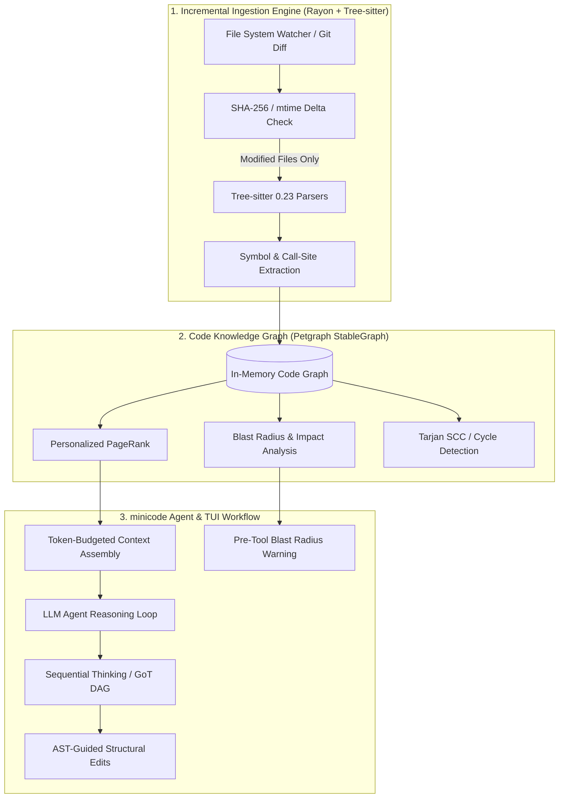
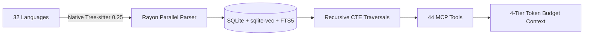
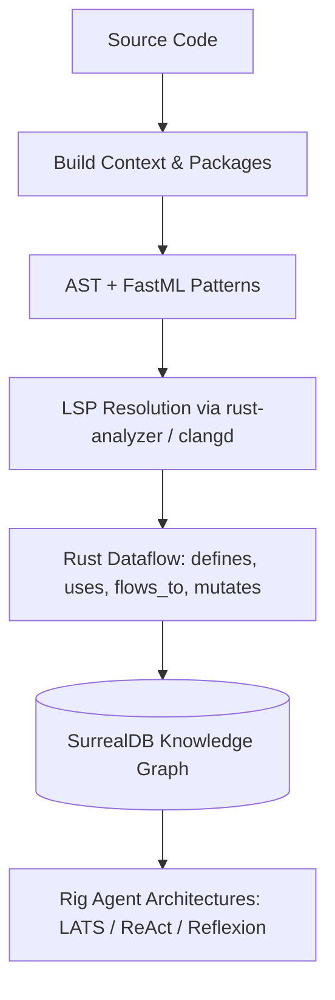
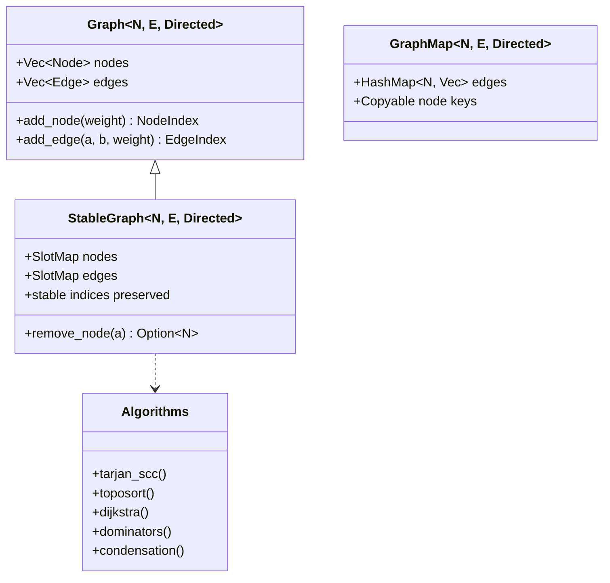
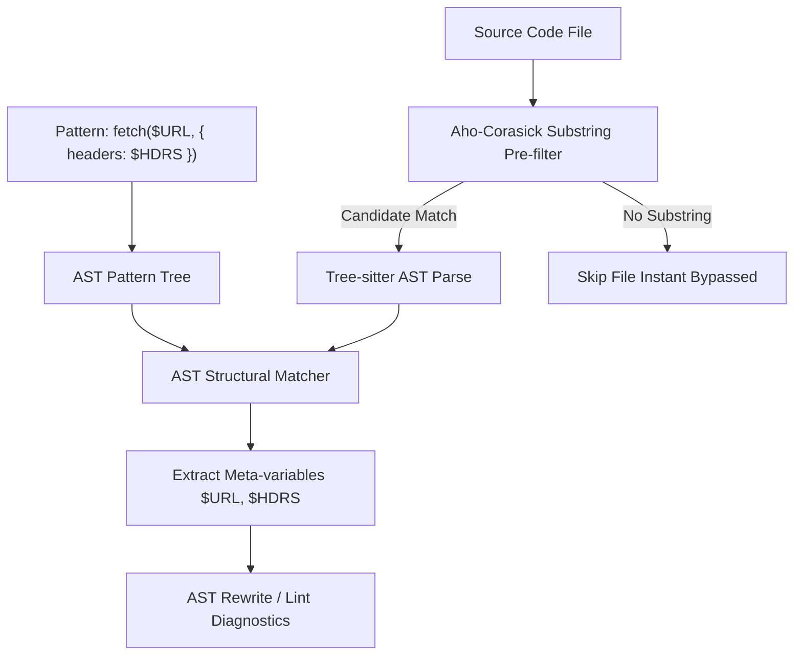
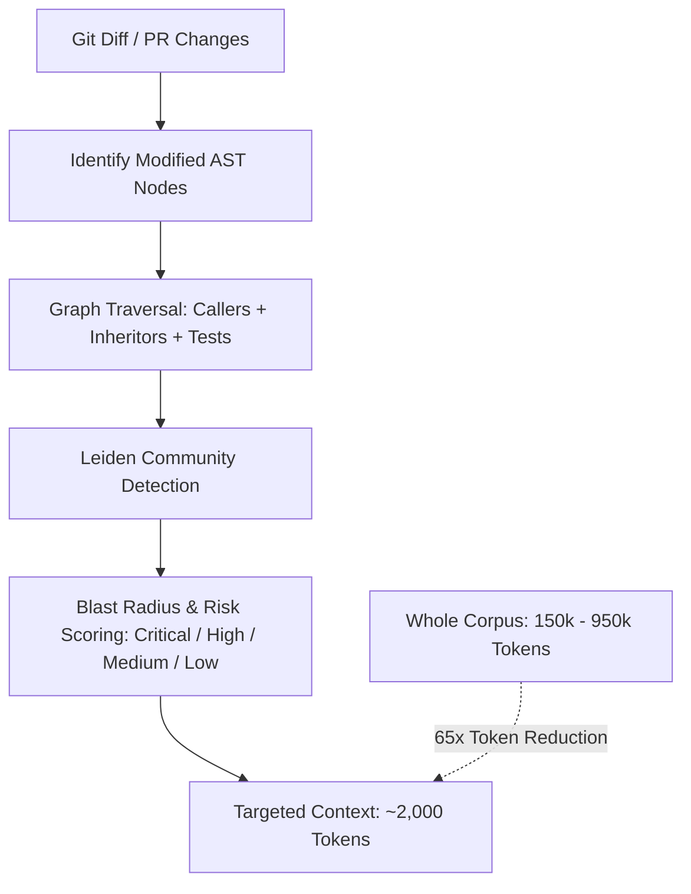
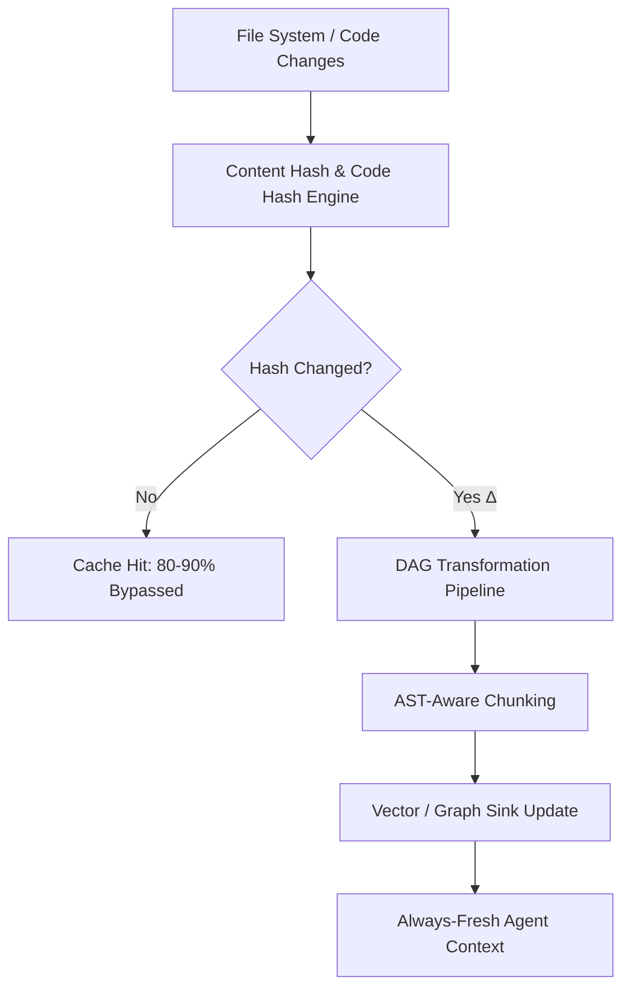
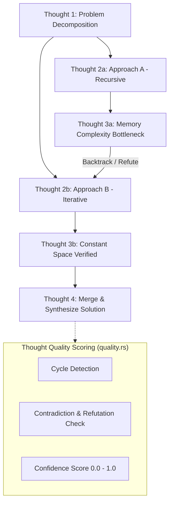

# Deep Technical Research: Graph Engineering, AST Parsing & Code Intelligence for `minicode`

> **Document Version:** 1.0.0  
> **Target System:** `minicode` (Fast, Minimalist TUI + CLI AI Coding Agent in Pure Rust)  
> **Focus Areas:** Graph Engineering, AST Parsing, Code Intelligence, Blast Radius Analysis, Graph of Thoughts (GoT)  
> **Date:** August 2026

---

## Executive Summary

To deliver sub-second codebase intelligence and maximize token efficiency in `minicode`, we researched 8 leading projects across graph engineering, AST analysis, incremental dataflow, and structured agent reasoning. 

Modern AI coding agents face a severe **context bottleneck**: whole-corpus scanning wastes tens of thousands of tokens per turn, introduces hallucinations, and degrades model attention. By combining **Tree-sitter AST extraction**, **Petgraph topological graph structures**, **content-hashed incremental memoization**, and **graph-guided context selection**, `minicode` can achieve **60–80x token reduction** while delivering sub-millisecond graph queries and instant blast-radius impact analysis.



---

## Project Research & Technical Profiles

```
├── 1. CodeGraph (suatkocar/codegraph)
├── 2. CodeGraph Rust (Jakedismo/codegraph-rust)
├── 3. Petgraph (petgraph/petgraph)
├── 4. Tree-sitter Graph (tree-sitter/tree-sitter-graph)
├── 5. AST-Grep (ast-grep/ast-grep)
├── 6. Code Review Graph (tirth8205/code-review-graph)
├── 7. CocoIndex (cocoindex-io/cocoindex)
└── 8. Sequential Thinking RS (aswin402/sequentialthinking_rs)
```

---

### 1. CodeGraph (`suatkocar/codegraph`)

- **Repository:** [https://github.com/suatkocar/codegraph](https://github.com/suatkocar/codegraph)
- **What It Does:** A native Rust codebase intelligence MCP server that indexes AST definitions, dependencies, and call relationships across 32 programming languages into SQLite (`sqlite-vec` + FTS5), providing graph-aware, token-budgeted context to AI agents.



#### Key Technical Highlights
- **Native Static Tree-sitter Grammars:** Compiles 32 Tree-sitter language grammars directly into the Rust binary at compile time. No WASM overhead, no runtime downloads, and zero external runtime dependencies.
- **SQLite with Recursive Common Table Expressions (CTEs):** Stores nodes (functions, classes, structs, traits, modules, files) and edges (calls, imports, inherits, tests) in SQLite. Traverses forward and reverse call graphs using recursive SQL CTEs (`WITH RECURSIVE`).
- **Hybrid Retrieval (RRF):** Combines SQLite FTS5 lexical keyword matching with `sqlite-vec` dense vector similarity using Reciprocal Rank Fusion (RRF).
- **10-Point Agent Lifecycle Hook System:** Automates graph synchronization and context injection across the agent lifecycle:
  - `SessionStart`: Incremental re-index (~12ms no-op).
  - `UserPromptSubmit`: Searches the graph and injects semantically relevant context before agent thinking begins.
  - `PreToolUse`: Injects symbol definitions and callers into context before file reading/editing.
  - `PostToolUse`: Instantly re-indexes edited files to maintain fresh graph state.
  - `PreCompact`: Captures a PageRank skeleton summary before conversation history compaction to prevent amnesia.
  - `TaskCompleted`: Runs quality gates checking for newly introduced dead code or broken references.
- **Token Reduction Benchmarks:** Demonstrates **68.3% average token reduction** (and up to 81.2% reduction on routing handlers) compared to raw file grep.

#### Inspiration for `minicode`
- **Agent Lifecycle Hooks:** Adapt the `PreToolUse`, `PostToolUse`, and `PreCompact` hooks into `minicode`'s agent execution loop (`src/agent/loop.rs`). Before an edit tool runs, `minicode` can display the target function's callers in the TUI; after an edit, it re-indexes in <10ms.
- **Pre-Compaction Skeleton Preservation:** When `minicode`'s context compressor (`src/context/compressor.rs`) trims conversation history, serialize the top-PageRank symbols into the system prompt to maintain structural awareness across long coding sessions.
- **4-Tier Token Budget Context Assembly:** Implement tiered context budgets (e.g. 500 tokens for brief overview, 2000 for standard, 8000 for deep refactoring) dynamically adjusting symbol signature verbosity.

#### Rust Crates / Dependencies Worth Noting
- `tree-sitter` (0.25), `rusqlite` (0.32 bundled), `sqlite-vec` (0.1), `zerocopy` (0.8), `rayon`, `thiserror`, `serde`.

---

### 2. CodeGraph Rust (`Jakedismo/codegraph-rust`)

- **Repository:** [https://github.com/Jakedismo/codegraph-rust](https://github.com/Jakedismo/codegraph-rust)
- **What It Does:** A 100% Rust implementation of Code GraphRAG featuring multi-tiered AST + FastML parsing, SurrealDB graph backend, LSP resolution, and Rig-based agentic reasoning architectures for code exploration and impact analysis.



#### Key Technical Highlights
- **Tiered Indexing Engine (`fast` vs `balanced` vs `full`):**
  - `fast`: AST syntax tree parsing and core edges only; skips LSP and dataflow for near-instant indexing on startup.
  - `balanced`: Adds LSP symbol resolution, markdown doc linking, and cross-file module hierarchy linking.
  - `full`: Complete AST + LSP definitions + fine-grained dataflow analysis (`defines`, `uses`, `flows_to`, `returns`, `mutates`) + architectural boundary verification.
- **Architectural Boundary Enforcement:** Reads `codegraph.boundaries.toml` to define forbidden cross-crate or cross-module dependencies (`[[deny]] from = "ui" to = "db"`), emitting `violates_boundary` graph edges when violated.
- **Agent Reasoning Architectures (Rig Framework):**
  - **LATS (Language Agent Tree Search):** Multi-path exploratory search for complex structural questions and code quality assessments.
  - **ReAct (Reasoning + Acting):** Fast, linear reasoning for targeted symbol lookups and impact chains.
  - **Reflexion (Self-Correction):** Automatically activates when initial graph queries yield no results, refining the search query based on failure diagnostics.
- **Zero-Copy High-Speed Serialization:** Utilizes `rkyv` (v0.8), `bytecheck`, and `rend` for zero-allocation deserialization of cached graph structures.

#### Inspiration for `minicode`
- **Configurable Indexing Tiers in `minicode`:** Allow `minicode` to default to `fast` mode on startup (sub-100ms startup in TUI), while offering `--deep` or background elevation to `full` mode when performing architectural refactoring.
- **Architectural Boundary Rules:** Add optional `minicode.boundaries.toml` support to detect unauthorized layer violations (e.g. CLI importing private TUI internals) directly in `minicode`'s linter/review tools.
- **High-Performance AST Caching via `rkyv`:** Replace standard JSON/bincode caching for AST symbol tables with `rkyv` for zero-cost mmap-based deserialization.

#### Rust Crates / Dependencies Worth Noting
- `rkyv` (0.8.8), `bytecheck`, `rend`, `tokenizers` (0.22), `rmcp`, `tokio`, `thiserror`, `surrealdb`.

---

### 3. Petgraph (`petgraph/petgraph`)

- **Repository:** [https://github.com/petgraph/petgraph](https://github.com/petgraph/petgraph)
- **What It Does:** The standard, battle-tested graph data structure and algorithm library for Rust, providing generic directed and undirected graphs, adjacency lists, generational index tracking, and core graph algorithms.



#### Key Technical Highlights
- **Specialized Graph Storage Layouts:**
  - `Graph<N, E, Directed>`: Contiguous vector-backed adjacency list. Highest iteration speed and lowest memory overhead ($O(1)$ node lookup via `NodeIndex`). Note: removing a node swaps with the last element, invalidating indices.
  - `StableGraph<N, E, Directed>`: Free-list / slot-backed graph layout. Preserves `NodeIndex` and `EdgeIndex` validity even after node/edge deletions. Essential for dynamic code graphs where files and functions are created, edited, and deleted.
  - `GraphMap<N, E, Directed>`: Node weights serve as keys (must implement `Copy + Eq + Hash`). Ideal for lightweight path-to-path or symbol-to-symbol graphs.
  - `MatrixGraph<N, E, Directed>`: Adjacency matrix representation for dense graphs with $O(1)$ edge existence checks.
- **Comprehensive Graph Algorithms:**
  - **Cycle Detection & Topological Sort:** `algo::is_cyclic_directed`, `algo::toposort` for dependency evaluation and build-order resolution.
  - **Strongly Connected Components (SCC):** `algo::tarjan_scc` and `algo::condensation` to detect circular dependency clusters and collapse mutual call loops into single super-nodes.
  - **Dominator Trees:** `algo::dominators::simple_fast` (Lengauer-Tarjan algorithm) to identify single points of failure and control-flow dominance in execution paths.
  - **Personalized PageRank & Centrality:** Enables ranking code symbols based on connectivity, with personalization biases towards currently active files.
  - **Graphviz Export:** Native `petgraph::dot::Dot` for rendering graph states to DOT / Graphviz format.

#### Inspiration for `minicode`
- **Migrate `minicode`'s Graph to `StableGraph`:** Upgrade `minicode`'s `DiGraph<PathBuf, ()>` in `src/context/graph.rs` to `StableGraph<CodeNode, CodeEdge>`. This allows `minicode` to incrementally delete and recreate file/symbol subgraphs as files are modified during an editing session without corrupting node indices.
- **Condensation Graphs for Module Clustering:** Use `petgraph::algo::condensation` to detect circular crate/module dependencies and summarize large codebases into a high-level component DAG.
- **Dominator Analysis for Blast Radius Root Causes:** Run dominator tree calculations on call graphs to pinpoint the exact root function governing downstream broken calls.

#### Rust Crates / Dependencies Worth Noting
- `petgraph` (0.6 / 0.7), `fixedbitset`, `indexmap`.

---

### 4. Tree-sitter Graph (`tree-sitter/tree-sitter-graph`)

- **Repository:** [https://github.com/tree-sitter/tree-sitter-graph](https://github.com/tree-sitter/tree-sitter-graph)
- **What It Does:** A domain-specific language (DSL) and Rust execution engine that transforms Tree-sitter Concrete Syntax Trees (CSTs) into arbitrary graph structures (such as Stack Graphs, Call Graphs, and Scope Graphs) using declarative S-expression pattern matching.

```mermaid
graph LR
    CST[Tree-sitter CST] --> Query[Pattern Query: (function_item name: @name)]
    Query --> TSG[TSG Stanza Execution]
    subgraph TSG DSL Directives
        D1[let n = node 'function']
        D2[attr n.symbol = @name]
        D3[edge caller -> callee]
    end
    TSG --> D1
    TSG --> D2
    TSG --> D3
    D3 --> TargetGraph[(Constructed Semantic Graph)]
```

#### Key Technical Highlights
- **Declarative Graph Construction DSL:** Replaces imperative, fragile manual AST traversal code with clean `.tsg` transformation rules:
  ```tsg
  ; Match function definitions and construct graph nodes
  (function_item name: (identifier) @name) @func {
    let n = node "function"
    attr n.symbol = @name
    attr n.start_line = (start_row @func)
    var func_node = n
  }

  ; Connect function calls to definitions
  (call_expression function: (identifier) @callee) {
    let call = node "call_site"
    attr call.target = @callee
    edge func_node -> call
  }
  ```
- **Execution Engine Mechanics:**
  - Combines Tree-sitter query pattern matching with an interpreted graph construction environment.
  - Supports scoped variables (`let` for stanza-local bindings, `var` for parent-scope/global bindings).
  - Handles lazy evaluation and multi-pass attribute resolution across graph stanzas.
- **Powers GitHub's `stack-graphs`:** The underlying engine powering GitHub's zero-build-environment code navigation (Jump to Definition and Find All References) across millions of repositories.

#### Inspiration for `minicode`
- **Declarative Extraction Rules for New Languages:** Instead of writing hundreds of lines of procedural Rust parser code for each new language in `src/context/repomap.rs`, write declarative query files (`queries/rust.tsg`, `queries/python.tsg`).
- **Scope Graphs for Accurate Identifier Resolution:** Utilize scope-graph concepts (lexical scopes, symbol definitions, reference resolution) to resolve identifier references accurately without requiring heavy language server daemons.
- **Language-Agnostic Core:** Decouple language syntax quirks from `minicode`'s core graph representation, making the addition of new languages as simple as adding a `.scm` or `.tsg` query file.

#### Rust Crates / Dependencies Worth Noting
- `tree-sitter-graph` (0.12), `tree-sitter` (0.23/0.25), `stack-graphs`, `string-interner`, `smallvec`.

---

### 5. AST-Grep (`ast-grep/ast-grep`)

- **Repository:** [https://github.com/ast-grep/ast-grep](https://github.com/ast-grep/ast-grep)
- **What It Does:** A fast, syntax-aware structural code search, linting, and AST-rewriting engine in Rust powered by Tree-sitter, allowing developers and agents to match code by its syntax structure rather than text regex.



#### Key Technical Highlights
- **Code-Like Meta-Variable Pattern Syntax:**
  - `$VAR`: Matches any single AST node (identifiers, expressions, types).
  - `$$$VARS`: Multi-node wildcard matching zero or more sibling AST nodes (parameter lists, statements).
  - Example: `fn $NAME($$$ARGS) -> Result<$T> { $$$BODY }` structurally matches any Rust function returning a `Result`.
- **Relational AST Rules:**
  - `has`: Matches if any child node satisfies sub-rules.
  - `inside`: Matches if the node is nested within a specific parent (e.g. inside an `unsafe` block or `async fn`).
  - `follows` / `precedes`: Matches sibling sequence ordering.
  - `all` / `any` / `not`: Boolean composition of structural constraints.
- **High-Speed Pre-filtering Pipeline:** Avoids parsing every file with Tree-sitter. Extracts invariant string literals from the query pattern and runs an `aho-corasick` or `grep-searcher` scan first. Only files containing the required substrings are parsed into ASTs.
- **Modular Rust Crate Hierarchy:**
  - `ast-grep-core`: Core matching algorithms, AST visitor, meta-variable bindings.
  - `ast-grep-language`: Grammar wrappers and language configuration.
  - `ast-grep-config`: YAML rule definitions, fix templates, and severity levels.
  - `ast-grep-cli`: Multi-threaded CLI engine with interactive diff rendering.

#### Inspiration for `minicode`
- **AST-Aware Search & Rewrite Tool for `minicode` (`ast_search` / `ast_replace`):** Provide the AI agent with structural search tools instead of relying solely on regex `grep_search`. An agent can query `app.listen($PORT)` or rewrite deprecated API calls across a codebase with 100% syntactic precision.
- **Substring Pre-Filtering for Fast Repo-Maps:** Adopt AST-Grep's pre-filtering strategy in `minicode`'s `RepoMapExtractor` to skip Tree-sitter parsing on unchanged or irrelevant files during broad symbol searches.
- **Syntactically Safe Code Editing:** Leverage AST-based template rewriting to guarantee that agent code edits do not introduce syntax errors, mismatched brackets, or broken AST nodes.

#### Rust Crates / Dependencies Worth Noting
- `ast-grep-core`, `tree-sitter`, `aho-corasick`, `ignore`, `rayon`, `bitflags`, `similar`.

---

### 6. Code Review Graph (`tirth8205/code-review-graph`)

- **Repository:** [https://github.com/tirth8205/code-review-graph](https://github.com/tirth8205/code-review-graph)
- **What It Does:** An intelligent codebase mapping and code review system that parses source repositories into SQLite graphs with Tree-sitter, calculates community clusters via the Leiden algorithm, and computes minimal blast-radius review contexts for AI assistants and CI pipelines.



#### Key Technical Highlights
- **Blast-Radius Impact Computation:** When a code symbol or file changes, the graph traverses outward:
  1. Direct callers (`calls` reverse edges).
  2. Indirect callers (transitive $k$-hop callers).
  3. Class / trait inheritors (`implements` / `extends` edges).
  4. Test coverage linkages (`tests` edges).
  The resulting subgraph is classified into risk levels (Critical, High, Medium, Low) based on caller centrality and test gap presence.
- **Leiden Community Detection Algorithm:** Runs the Leiden graph clustering algorithm with fixed random seeds to discover architectural module boundaries and compute cross-boundary coupling without manual directory configuration.
- **Measurable Token Efficiency:**
  - Median per-question token reduction of **~65x** across benchmarked repositories (FastAPI: 375.6x reduction, Flask: 71.0x, HTTPX: 60.6x).
  - Shrinks 200k–950k source token corpuses down to ~2,000–3,500 token contextual answer packets.
- **Deterministic Embeddings & SQLite Store:** Uses deterministic CPU embeddings (`all-MiniLM-L6-v2`) and a normalized SQLite schema for portable local caching and fast CI runner execution.
- **Custom Extensibility (`languages.toml`):** Allows users to add support for any Tree-sitter language grammar by mapping AST node types in TOML without recompiling the codebase.

#### Inspiration for `minicode`
- **`minicode review` Mode & Blast Radius Tool (`blast_radius`):** Add an explicit impact analysis tool to `minicode`. When an agent proposes a change to a core function, the tool immediately outputs all affected callers, dependents, and missing test files.
- **TUI Risk Assessment Badge:** In `minicode`'s TUI timeline, display a compact risk badge (e.g. `[Risk: HIGH | 14 callers | 0 tests]`) before applying diffs.
- **Extensible `languages.toml` Config:** Allow users to define custom language bindings in `~/.config/minicode/languages.toml` mapping file extensions to Tree-sitter query captures.

#### Rust Crates / Dependencies Worth Noting
- `tree-sitter`, `rusqlite`, `petgraph`, `ignore`, `fastembed` (for local pure-Rust CPU embeddings).

---

### 7. CocoIndex (`cocoindex-io/cocoindex`)

- **Repository:** [https://github.com/cocoindex-io/cocoindex](https://github.com/cocoindex-io/cocoindex)
- **What It Does:** An incremental data pipeline and live semantic indexing engine featuring a high-performance Rust core that models index transformations as a Directed Acyclic Graph (DAG), computing only deltas ($\Delta$) with 80–90% cache hits and sub-second freshness.



#### Key Technical Highlights
- **Delta-Only ($\Delta$) Incremental Transformation Engine:**
  - Treats data and code transformations as an execution DAG of discrete operations.
  - Content Hashing + Function Hash Tracking: Memoizes transformation steps using both the SHA-256 hash of the input data and the hash of the transformation logic.
  - Automatically isolates modified files and updates only affected downstream sinks (vector DB, symbol tables, graph relations).
- **Declarative Target-State Synchronization:**
  - Developers define the target schema; the Rust core calculates the exact symmetric diff (insert, update, delete) and applies minimal database mutations.
- **High Concurrency & Low Overhead:**
  - Written in Rust for maximum memory efficiency, zero-copy record slicing, and thread-pool parallelization.
  - Delivers **80–90% cache hit rates** on re-indexing, enabling live background synchronization during active coding sessions.
- **`cocoindex-code` Flagship MCP Server:**
  - Provides AST-aware chunking preserving function/class boundaries, live call-graph extraction, and blast-radius calculation for Claude Code and Cursor.

#### Inspiration for `minicode`
- **Memoized Incremental AST Pipeline for `minicode`:** Implement a content-hash-backed transformation pipeline in `src/context/repomap.rs`. Store `(file_path, sha256_hash, parser_version)` in an in-memory/disk cache. If a file is touched without AST changes (e.g. comments or whitespace), skip downstream graph updates entirely.
- **Sub-Second Live Re-Indexing via `notify`:** Connect an async file watcher (`notify` crate) to `minicode`'s graph engine. When the user or agent edits a file, trigger a background delta update in tokio so the graph is always 100% fresh without manual re-index commands.
- **Symmetric Graph Diffing:** When a file is updated, calculate the graph delta (deleted symbols, added symbols, modified call edges) and apply incremental mutations to `StableGraph` rather than rebuilding the entire repository graph.

#### Rust Crates / Dependencies Worth Noting
- `tokio`, `notify` (v6), `sha2`, `petgraph`, `tree-sitter`, `rayon`, `dashmap`, `parking_lot`.

---

### 8. Sequential Thinking RS (`aswin402/sequentialthinking_rs`)

- **Repository:** [https://github.com/aswin402/sequentialthinking_rs](https://github.com/aswin402/sequentialthinking_rs)
- **What It Does:** A high-performance, persistent, graph-structured reasoning engine and MCP server in Rust (Edition 2024), implementing a Graph of Thoughts (GoT) Directed Acyclic Graph (DAG) for non-linear agent reasoning, branching, backtracking, and thought merging.



#### Key Technical Highlights
- **Graph of Thoughts (GoT) DAG Reasoning Model:**
  - Extends traditional linear thinking chains into a Directed Acyclic Graph.
  - Supports multi-parent thought merging (`parentThoughts: [2, 5]`), hypothesis branching, backtracking, and explicit thought revisions (`revisesThought: 3`).
- **Real-Time Thought Quality & Contradiction Detection (`quality.rs`):**
  - Evaluates thought graph integrity with a 0–100 composite quality score.
  - Automatically detects circular reasoning paths (`detect_cycles`) and contradictory assertions where an assumption is later marked `refuted` or `false`.
  - Flags unverified assumptions and low-confidence branches (`confidenceScore < 0.5`).
- **Persistent Multi-Session Architecture:**
  - Full SQLite database persistence layer (`persistence/sqlite.rs`) + in-memory store with multi-session isolation via `sessionId`.
  - Thought histories survive server restarts and agent context resets.
- **Native Rust Performance & Portability:**
  - **<1ms cold start latency** and **<4MB memory footprint** (compared to 150–200ms and 30–50MB in the TypeScript implementation).
  - Pure Rust Edition 2024 codebase with dual Stdio and HTTP/SSE transports (`axum`, `tower`, `tokio-stream`).
- **Mermaid Diagram Generation (`mermaid.rs`):**
  - Generates live visual Mermaid diagrams representing the reasoning graph structure, confidence tiers, and branch resolutions.

#### Inspiration for `minicode`
- **Native Graph of Thoughts Reasoning in `minicode`'s Agent Loop:** Integrate the Sequential Thinking GoT DAG directly into `src/agent/loop.rs` as an internal reasoning engine. For complex refactoring or debugging tasks, the agent can branch hypotheses, verify assumptions against the code graph, and prune invalid paths before generating code diffs.
- **TUI Reasoning Graph Rendering:** Use `mermaid.rs` logic or a custom Ratatui canvas widget to render the agent's thought graph directly inside `minicode`'s interactive TUI timeline.
- **Persistent Agent Deliberation Sessions:** Store agent thought DAGs in `minicode`'s session JSONL/SQLite database alongside tool execution histories, allowing users to resume or branch past reasoning sessions.

#### Rust Crates / Dependencies Worth Noting
- `tokio` (1.40), `rusqlite` (0.32), `serde`, `serde_json`, `clap`, `chrono`, `tracing`, `axum`, `uuid`.

---

## Comparative Architectural Matrix

| Project | Primary Language | Graph Store / Structure | AST / Syntax Parser | Search / Retrieval Model | Incremental Engine | Key Specialization |
| :--- | :--- | :--- | :--- | :--- | :--- | :--- |
| **CodeGraph** | Rust | SQLite (CTEs) | Native Tree-sitter (32 langs) | FTS5 + `sqlite-vec` + RRF | Rayon parallel + mtime | 44 MCP Tools, 10 Lifecycle Hooks, Token Budgets |
| **CodeGraph Rust** | Rust | SurrealDB + `rkyv` | Tree-sitter + FastML | SurrealQL + Rig Agents | Tiered (Fast/Balanced/Full) | LATS / ReAct / Reflexion Agent Reasoning |
| **Petgraph** | Rust | Memory (`StableGraph`, `GraphMap`) | N/A (Graph Library) | Graph Traversal / Dijkstra / A* | In-Memory SlotMap mutations | Foundation Graph Algorithms, Dominators, SCC |
| **Tree-sitter Graph** | Rust | In-Memory DSL Graph | Tree-sitter CST | Pattern Query Matching | Stanza evaluation | Declarative Graph Construction DSL |
| **AST-Grep** | Rust | In-Memory AST Trees | Tree-sitter AST | Aho-Corasick + Structural AST | Parallel Rayon file traversal | AST Structural Search & Rewriting, Meta-vars |
| **Code Review Graph** | Python | SQLite | Tree-sitter + Fallbacks | Leiden Graph + `all-MiniLM-L6-v2` | Git diff + SHA-256 hash | Blast-Radius Analysis, PR Risk Scoring |
| **CocoIndex** | Rust + Python | Transformation DAG | Tree-sitter Chunking | Vector + Graph Targets | Hash Memoization DAG (Δ-only) | Streaming Incremental ETL, 80-90% Cache Hits |
| **Sequential Thinking RS**| Rust | In-Memory + SQLite DAG | N/A (Thought Graph) | GoT Graph Traversal | Session State Persistence | Graph of Thoughts (GoT), Cycle/Contradiction Check |

---

## Top 5 Actionable Ideas for `minicode`'s Graph & AST Subsystem

Based on this deep technical investigation, here are the **Top 5 high-impact, actionable architectural blueprints** to implement in `minicode`.

---

### 1. Upgrade `minicode` to a `StableGraph`-Backed Incremental Semantic Graph

> [!IMPORTANT]
> **Problem:** `minicode` currently uses `DiGraph<PathBuf, ()>` in `src/context/graph.rs`, which only tracks file paths without symbol nodes, edge semantics, or stable deletion handling.

#### Implementation Blueprint:
1. Define a rich node and edge model:
   ```rust
   #[derive(Debug, Clone, Serialize, Deserialize)]
   pub enum CodeNode {
       File { path: PathBuf, hash: [u8; 32] },
       Function { name: String, file: PathBuf, line: usize, is_public: bool },
       Struct { name: String, file: PathBuf, line: usize },
       Trait { name: String, file: PathBuf, line: usize },
       Module { name: String, path: PathBuf },
   }

   #[derive(Debug, Clone, Serialize, Deserialize)]
   pub enum CodeEdge {
       Calls,
       Imports,
       Defines,
       Implements,
       Tests,
   }
   ```
2. Replace `DiGraph` with `petgraph::stable_graph::StableGraph<CodeNode, CodeEdge, petgraph::Directed>`.
3. Use a secondary `HashMap<String, NodeIndex>` symbol lookup index. When a file is edited, remove only that file's child symbol nodes and edges in $O(k)$ time using `StableGraph::remove_node` without invalidating indices of other files.

---

### 2. Implement Sub-Second Delta ($\Delta$) Ingestion with Content Hashing

> [!TIP]
> **Inspiration:** CocoIndex & CodeGraph (Rayon parallel parsing + content hash memoization).

#### Implementation Blueprint:
1. Create an in-memory / disk cache storing `(PathBuf, [u8; 32], SystemTime, Vec<SymbolDef>)`.
2. On session start or file save:
   - Compute fast Blake3 or SHA-256 hash of modified files.
   - If hash matches cached entry, skip AST parsing completely (~1ms no-op check).
   - If changed, parse only that file with Tree-sitter in parallel using `rayon`.
3. Connect an async `notify` file watcher in Tokio so `minicode` continuously updates its graph in the background during coding sessions.

---

### 3. Native Blast-Radius & Impact Analysis Tool (`minicode impact`)

> [!TIP]
> **Inspiration:** Code Review Graph & CodeGraph.

#### Implementation Blueprint:
1. Implement a new agent tool: `get_blast_radius(symbol_name: &str, file_path: &str) -> ImpactReport`.
2. Algorithm:
   - Locate target node in `StableGraph`.
   - Traverse incoming `Calls` edges up to $k$ hops (default $k=3$) to find all direct and transitive callers.
   - Traverse incoming/outgoing `Tests` edges to find associated test suites.
   - Run `petgraph::algo::tarjan_scc` to identify if the symbol belongs to a tightly coupled mutual dependency cycle.
3. Generate a compact summary for the agent:
   ```
   Blast Radius for `auth::verify_token`:
   - Direct Callers (3): `api::routes::login`, `api::routes::refresh`, `middleware::auth_guard`
   - Transitive Impact: 8 endpoints affected across 3 crates
   - Associated Tests: `tests/auth_test.rs` (Covered)
   - Risk Assessment: MEDIUM (3 direct callers, 1 test suite)
   ```
4. Render a risk badge directly in `minicode`'s TUI timeline before applying diffs.

---

### 4. AST Structural Search & Rewrite Tool (`ast_search` / `ast_replace`)

> [!TIP]
> **Inspiration:** AST-Grep.

#### Implementation Blueprint:
1. Add syntax-aware structural search to `minicode`'s tool suite alongside regex `grep_search`.
2. Syntax:
   - Agent inputs pattern: `fn $NAME($$$ARGS) -> Result<$RET>`
   - `minicode` parses pattern with Tree-sitter, extracts invariant literals (`fn`, `Result`), and runs `grep-searcher` pre-filtering across workspace files.
   - Matches candidate AST nodes structurally and binds meta-variables (`$NAME`, `$$$ARGS`, `$RET`).
3. Allows `minicode` agents to perform large-scale refactorings without breaking syntax or relying on fragile multiline regex.

---

### 5. Native Graph of Thoughts (GoT) Deliberation in `minicode`'s Agent Loop

> [!TIP]
> **Inspiration:** `sequentialthinking_rs` (`aswin402/sequentialthinking_rs`).

#### Implementation Blueprint:
1. Embed the `SequentialThinking` engine directly into `src/agent/` as an internal cognitive deliberation module before destructive actions.
2. For complex user instructions (e.g. "refactor authentication to use JWT with refresh tokens"):
   - The agent enters a deliberation phase, creating a lightweight GoT DAG.
   - Explores multiple implementation branches, verifies assumptions against the `StableGraph`, and checks for contradictions (`quality.rs`).
   - Merges reasoning branches into a synthesized execution plan.
3. Render a live collapsible thought graph widget in `minicode`'s Ratatui TUI timeline, giving the user full visibility into the agent's internal reasoning progression.

---

## Conclusion & Next Steps

By incorporating these patterns, `minicode` will bridge the gap between minimalist terminal performance and deep architectural code intelligence:

1. **Phase 1 (Graph Core):** Implement `StableGraph<CodeNode, CodeEdge>` in `src/context/graph.rs` and Blake3 delta hashing in `src/context/repomap.rs`.
2. **Phase 2 (Code Intelligence Tools):** Expose `blast_radius` and `ast_search` tools to `minicode`'s agent tool registry.
3. **Phase 3 (Agent Loop & TUI Integration):** Integrate `sequentialthinking_rs` GoT reasoning into `src/agent/` with real-time TUI timeline rendering.
