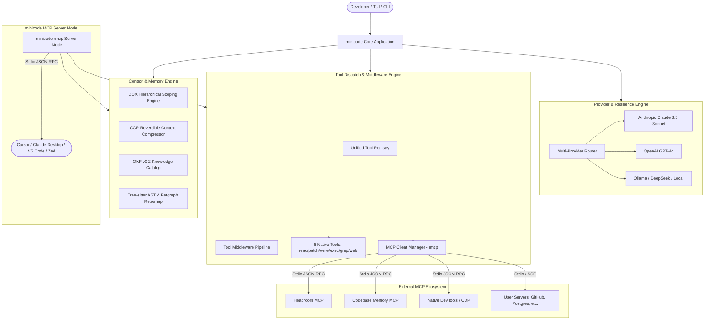

# Comprehensive Research: Model Context Protocol (MCP), Agent Gateways & Protocol Engineering

> **Target Project:** `minicode` — Fast, Minimalist TUI + CLI AI Coding Agent in Pure Rust  
> **Author:** Deep Technical Researcher  
> **Date:** August 2026  
> **Document Purpose:** Deep technical analysis of 8 foundational protocol and MCP systems to inform minicode's architecture, tool federation, context engineering, and inter-agent communication.

---

## Executive Summary

As AI coding agents transition from monolithic, single-prompt tools to distributed, multi-modal, and multi-agent workflows, standardized protocols play a crucial role in performance, extensibility, and maintainability. This research investigates 8 cutting-edge projects spanning **Model Context Protocol (MCP)** implementations, **Agent Gateways & Proxies**, **High-Performance AST Knowledge Graphs**, **Binary IPC (gRPC/Tonic)**, and **Knowledge Representation Standards (OKF)**.

By leveraging Pure Rust crates (`rmcp`, `tonic`, `tree-sitter`, `petgraph`, `rusqlite`, `schemars`), `minicode` can implement:
1. **Full Dual-Mode MCP Support:** Operating as both an **MCP Client** (consuming external tool servers like GitHub, Postgres, Headroom) and an **MCP Server** (exposing minicode's AST search, repomap, and precise file patching tools to external agents and IDEs).
2. **Deterministic Context Compression (CCR & DOX):** Embedding in-process minification and hierarchical rule scoping from `headroom-mcp` to slash token consumption by 60–90%.
3. **High-Speed AST Code Intelligence:** Adopting `codebase-memory-mcp`'s RAM-first knowledge graph architecture and git diff impact mapping for sub-millisecond symbol resolution and safety checks.
4. **Resilient Tool Federation & Gateway Routing:** Employing gateway patterns from `agentgateway` and middleware pipelines from `fastmcp` for namespace routing, token budgeting, and multi-provider failovers.
5. **Standardized Agent Memory via OKF v0.2:** Implementing human- and agent-readable Markdown+YAML knowledge bundles for persistent repository memory and progressive context disclosure.

---

## Detailed Project Research

---

### 1. MCP Rust SDK (`rmcp`)

- **Project Name & URL:** MCP Rust SDK — [modelcontextprotocol/rust-sdk](https://github.com/modelcontextprotocol/rust-sdk)
- **What It Does:** The official Rust implementation of the Model Context Protocol (MCP) providing async, type-safe primitives and procedural macros for building high-performance MCP clients and servers on the Tokio runtime.

#### Key Technical Highlights
- **Full Spec Compliance:** Implements the stable MCP **`2026-07-28`** specification while maintaining backward compatibility with **`2025-11-25`** and earlier releases.
- **Dual-Role Architecture:** Fully implements both `RoleServer` (`ServerHandler` trait) and `RoleClient` (`ClientHandler` trait) over abstract transports.
- **Transport Abstraction:**
  - **Stdio Transport:** Subprocess management via `tokio::process::Command` / `TokioChildProcess`, stdin/stdout byte streams with JSON-RPC framing.
  - **Streamable HTTP / SSE Transport:** Transport-neutral event streaming and HTTP routing headers.
  - **In-Memory Duplex Channels:** Zero-overhead in-process communication for embedded servers and unit testing.
- **Declarative Procedural Macros:**
  - `#[tool]`, `#[tool_router]`, `#[tool_handler]` automatically derive JSON Schemas (Draft 2020-12) via `schemars::JsonSchema` from typed Rust structs (`Parameters<T>`).
  - `#[prompt]`, `#[prompt_router]`, `#[prompt_handler]` for typed prompt templates.
- **Lifecycle & Discovery Modes:** Supports `ClientLifecycleMode::Initialize` (traditional JSON-RPC handshake), `ClientLifecycleMode::Discover` (zero-handshake server discovery carrying client capabilities in `_meta`), and `ClientLifecycleMode::Auto` (probing with fallback).
- **Rich Content Support:** Native `ContentBlock` constructors for `text`, `image` (base64 PNG/JPEG), `audio` (base64 WAV/MP3), and embedded resources (`ResourceContents::text` / `ResourceContents::blob`).
- **Separation of Error Domains:** Explicit distinction between **Tool-level errors** (`CallToolResult::error(...)` rendered to the LLM) and **Protocol-level errors** (`Err(McpError)` / JSON-RPC error codes rendered opaquely).
- **Sampling & Elicitation:** Protocols for servers to request LLM completions (`sampling/createMessage`) or interactive human input (`elicitation/create`) from the host client.

#### Inspiration for minicode
- **Dual Client + Server Capability:**
  - **MCP Client for minicode:** Allow minicode to load external MCP servers from `~/.config/minicode/mcp.json` or `.minicode/mcp.json` (e.g., Git, GitHub, Postgres, Web Search, Headroom), dynamically registering external tools alongside minicode's 6 core native primitives (`read_file`, `patch_file`, `write_file`, `exec_cmd`, `grep_search`, `fetch_or_browse`).
  - **MCP Server Mode (`minicode serve`):** Allow minicode to be launched as a background MCP server over stdio. External IDEs (Cursor, Claude Desktop, VS Code, Zed) can then invoke minicode's high-precision AST code graph, repomap, and semantic diff engine directly.
- **Macro-Derived Tool Schemas:** Replace manual `serde_json::json!` schema definitions in `src/tools/mod.rs` with `schemars`-derived typed parameters, eliminating schema drift and manual JSON typing errors.
- **Sampling Support:** Enable downstream MCP servers to request completions from minicode's active LLM session without requiring independent API keys.

#### Rust Crates / Dependencies Worth Noting
- `rmcp` (core protocol, JSON-RPC serializer, client/server traits)
- `rmcp-macros` (procedural macros for routing and schema extraction)
- `schemars = "1.2"` (JSON Schema 2020-12 generation)
- `tokio = { version = "1.40", features = ["full"] }`
- `serde = { version = "1.0", features = ["derive"] }`
- `serde_json = "1.0"`
- `base64 = "0.22"`

---

### 2. Agent Gateway (`agentgateway`)

- **Project Name & URL:** Agent Gateway — [agentgateway/agentgateway](https://github.com/agentgateway/agentgateway)
- **What It Does:** A high-performance, open-source proxy and unified data plane written in Pure Rust for AI-native protocols (MCP, A2A, HTTP, gRPC), providing security guardrails, load balancing, dynamic routing, and observability for agentic workloads.

#### Key Technical Highlights
- **Rust-Native High-Throughput Proxy:** Built with `tokio`, `hyper`, and `tower` to manage long-lived stateful streaming connections, multi-round-trip agent handshakes, and high-concurrency tool fan-outs with minimal memory overhead.
- **Unified Multi-Protocol Data Plane:** Single binary that bridges LLM provider APIs (OpenAI, Anthropic, Gemini, Bedrock, Ollama, vLLM), MCP servers, and Agent-to-Agent (A2A) protocol exchanges.
- **xDS Dynamic Control Plane:** Employs an xDS-compatible control plane for zero-downtime hot-reloading of routing rules, model configurations, rate limits, and access policies.
- **Inference-Aware Routing:** Intelligently schedules inference calls across local and cloud backends by evaluating real-time metrics including GPU memory utilization, KV cache hit ratios, prefix caching alignment, and queue depths.
- **Tool Federation & MCP Multiplexing:** Aggregates dozens of disparate downstream MCP servers into a single coherent endpoint, handling authentication (JWT, OAuth), rate limiting, tool caching, and schema aggregation.
- **Policy Guardrails & Security:** Uses the CEL (Common Expression Language) engine for declarative, sub-millisecond policy evaluation on tool arguments before dispatch (e.g. blocking destructive commands or data leaks).
- **OpenTelemetry Observability:** Built-in distributed tracing, token usage metrics, latency profiling, and audit logging.

#### Inspiration for minicode
- **Tool Federation Engine:** minicode should include an in-process MCP aggregator (`src/tools/mcp/manager.rs`) that discovers, spins up, and manages multiple external MCP subprocesses, exposing them to the agent via clear namespaces (e.g. `mcp__<server_name>__<tool_name>`).
- **Resilient Provider Router & Failover:** Adapt agentgateway's multi-provider failover pattern into minicode's `src/agent/provider/` layer. When a provider returns HTTP 429 (rate limit) or 503 (overloaded), minicode can seamlessly fall back to an alternate configured provider (e.g. Claude 3.5 Sonnet → GPT-4o → Local DeepSeek-Coder).
- **Declarative Tool Policy Engine:** Introduce lightweight rule-based filters in minicode to intercept tool parameters (e.g. validating paths against workspace boundaries, blocking `rm -rf /` or unauthorized network calls) before execution.
- **Token & Cost Governance:** Track token usage and monetary cost per session, per tool, and per provider in real time.

#### Rust Crates / Dependencies Worth Noting
- `hyper = { version = "1.4", features = ["full"] }` & `hyper-util`
- `tower = { version = "0.5", features = ["full"] }` (composable middleware layers)
- `tonic = "0.12"` (gRPC transport)
- `cel-interpreter` or `cel-rs` (Common Expression Language policy evaluator)
- `opentelemetry = "0.24"` & `tracing-opentelemetry`

---

### 3. FastMCP (`fastmcp` by Prefect)

- **Project Name & URL:** FastMCP — [PrefectHQ/fastmcp](https://github.com/PrefectHQ/fastmcp)
- **What It Does:** The industry-standard application framework for Model Context Protocol (Python & TypeScript), providing ergonomic, low-boilerplate tool creation, transport negotiation, middleware hooks, and an interactive testing inspector.

#### Key Technical Highlights
- **Ergonomic Decorator/Macro Architecture:** Focuses on developer velocity: defining a tool requires only a standard typed function signature; JSON Schema generation, runtime parameter coercion, and documentation extraction happen automatically.
- **Composable Multi-Transport Engine:** Seamless switching and bridging between Stdio, Server-Sent Events (SSE), WebSockets, and Streamable HTTP.
- **Middleware & Interceptor Pipeline:** Pluggable middleware hooks (`before_tool_call`, `after_tool_call`, `on_error`) enabling centralized authentication, rate limiting, parameter validation, structured telemetry, and output sanitization.
- **Composite Tool Routing:** Built-in primitives to mount, namespace, and combine multiple sub-servers into a single composite MCP server.
- **OpenAPI to MCP Generation:** Automated bridge that ingests OpenAPI 3.0 / Swagger JSON specifications and transforms HTTP endpoints into fully typed MCP tools.
- **Developer Inspector & UI:** Local testing harness and web interface for live introspection, schema validation, and interactive tool debugging.

#### Inspiration for minicode
- **Tool Interceptor & Middleware Pipeline:** minicode can implement a unified `ToolMiddleware` trait in `src/tools/middleware.rs`:
  ```rust
  #[async_trait]
  pub trait ToolMiddleware: Send + Sync {
      async fn before_execute(&self, tool_name: &str, args: &serde_json::Value) -> Result<(), ToolError>;
      async fn after_execute(&self, tool_name: &str, result: &mut ToolResult);
  }
  ```
  This allows features like safety prompts, undo checkpoints, context compression (CCR), and execution timing to be composed modularly without cluttering `src/tools/mod.rs`.
- **Composite Namespacing:** Use standard hierarchical naming (`server_name.tool_name` or `server_name__tool_name`) so the LLM easily identifies tool origins and capabilities without schema collisions.
- **Automatic Parameter Coercion:** Handle slight model hallucination in parameter types (e.g. integer passed as string, single item passed instead of list) automatically in the dispatch layer.

#### Rust Crates / Dependencies Worth Noting
- `async-trait = "0.1"`
- `schemars = "1.2"`
- `serde = "1.0"`
- `serde_json = "1.0"`
- `futures = "0.3"`

---

### 4. Headroom MCP (`headroom-mcp` by Aswin)

- **Project Name & URL:** Headroom MCP — [aswin402/headroom-mcp](https://github.com/aswin402/headroom-mcp)
- **What It Does:** A high-performance, zero-dependency context compression layer and DOX scoping companion for AI coding agents, implemented as a native Rust MCP Server using `rmcp` and `rusqlite`.

#### Key Technical Highlights
- **100% Pure Rust Architecture:** Single compiled binary with sub-millisecond execution times and zero machine learning or cloud dependencies.
- **Hierarchical Instruction Scoping (DOX Pattern):** Recursively traverses directory trees from the workspace/git root down to the active file path, aggregating `AGENTS.md`, `CLAUDE.md`, `CURSOR.md`, and `.cursorrules` files. Eliminates instruction bloat by feeding the LLM only the relevant folder-scoped rules.
- **Reversible Local Compression (CCR - Context Compression & Retrieval):**
  - Deterministically minifies large structured files (JSON, CSV, YAML), unified git diffs, and verbose compiler/test output.
  - Replaces verbose blocks with compact semantic summaries and deterministic reference handles (e.g. `[CCR Ref: ccr_72fa11]`).
  - Stores uncompressed raw text in a high-speed hybrid cache (in-memory LRU + persistent SQLite).
  - Exposes `retrieve_original` tool so the agent can expand full raw data on demand if needed.
- **AST-Aware Code Signature Extraction:** Parses Rust, Python, and JavaScript/TypeScript files, stripping function/method bodies (`{ ... }`) while preserving type signatures, imports, structs, interfaces, and docstrings.
- **Command-Specific Output Minifiers:** Deep semantic parsers for `cargo test`, `cargo build`, `npm run build`, `pytest`, `git diff`, and `git status`. Strips compiler progress lines, package download noise, and hundreds of passing test lines while highlighting errors, warnings, stack traces, and failure locations (up to 90% token reduction).
- **Context Optimizers (`cache_align` & `compress_schema`):** Aligns context boundaries to provider prompt-caching blocks and strips redundant metadata from tool JSON schemas to maximize prompt cache hits.
- **Behavioral Scoping (`--enforce-yagni`):** Dynamically injects cognitive minimalism instructions to keep generated code compact, idiomatic, and standard-library-first.
- **19 Exposed MCP Tools:** Covers scoping (`scope_context`), compression (`compress_content`, `compress_file`, `compress_diff`, `compress_directory`), retrieval (`retrieve_original`), search (`search_cache`), execution (`run_and_compress`), and cache analytics.

#### Inspiration for minicode
- **Direct In-Process Integration:** Since `headroom-mcp` is developed in Pure Rust by the same author, its core algorithms can be directly embedded into `minicode` as an internal module (`src/context/compress.rs` and `src/context/dox.rs`) or consumed via native MCP client communication.
- **Automatic Output Minification for `exec_cmd`:** Run terminal command outputs through Headroom's semantic minifiers before appending to conversation context. Running `cargo test` in a large project will yield clean, concise failure reports instead of 20,000 tokens of passing test spam.
- **Dynamic DOX System Prompt Assembly:** Automatically load hierarchical `AGENTS.md` and `.cursorrules` when minicode accesses files in subdirectories, providing hyper-relevant context without exceeding token limits.
- **Schema Compression for Providers:** Strip descriptions and non-essential schema keys when communicating with smaller context models or optimizing prompt caching.

#### Rust Crates / Dependencies Worth Noting
- `rmcp = { version = "1.7", features = ["server", "macros", "transport-io"] }`
- `rusqlite = { version = "0.32", features = ["bundled"] }`
- `schemars = "1.2"`
- `ignore = "0.4"` (fast gitignore-aware filesystem walking)
- `regex = "1.10"`
- `html2md = "0.2"`

---

### 5. Native DevTools MCP (`native-devtools-mcp` by sh3ll3x3c)

- **Project Name & URL:** Native DevTools MCP — [sh3ll3x3c/native-devtools-mcp](https://github.com/sh3ll3x3c/native-devtools-mcp)
- **What It Does:** A cross-platform MCP server written in Rust providing AI agents with direct control over native desktop applications (macOS AX, Windows UIA), mobile devices (Android ADB), and Chrome/Electron browsers via Chrome DevTools Protocol (CDP).

#### Key Technical Highlights
- **Tri-Modal Automation Engine:** Combines Computer Vision (screenshots + OCR), Accessibility Tree Dispatch (macOS AX & Windows UIA), and Chrome DevTools Protocol (CDP) in a single unified server.
- **Element-Precise macOS Accessibility (AX) Dispatch:**
  - Tools: `take_ax_snapshot`, `ax_click`, `ax_set_value`, `ax_select`.
  - Directly dispatches actions against the OS Accessibility hierarchy without moving the physical mouse cursor or stealing active window focus.
- **Direct Chrome DevTools Protocol (CDP) Client:**
  - Connects directly via WebSockets to Chrome or Electron apps (VS Code, Discord, Slack, custom web apps) running with `--remote-debugging-port`.
  - Performs DOM snapshotting (`cdp_take_dom_snapshot`), selector queries (`cdp_find_elements`), input typing, clicks, and JavaScript evaluation without requiring heavy Playwright/Puppeteer runtimes.
- **Native OS Computer Vision & OCR:**
  - Integrates native platform OCR engines (Apple Vision framework on macOS, Windows Media OCR on Windows) for zero-dependency text extraction from screen regions.
  - Template image matching (`find_image`) for custom rendered canvas/game elements.
- **Android Device Automation via ADB:** Captures screen frames, dumps `uiautomator` UI hierarchies, and injects touch/key events over USB or Wi-Fi.

#### Inspiration for minicode
- **Browser Automation via CDP:** minicode has an optional `browser` feature (`chromiumoxide`). Adding CDP-based DOM inspection and console log streaming allows minicode to verify web applications, run frontend integration tests, and inspect runtime console errors while debugging code.
- **Multimodal Visual Verification:** Allow minicode to capture screenshots of rendered web pages or GUI applications during development and pass them to multimodal LLMs (Claude 3.5 Sonnet / GPT-4o) to verify visual styling, layout fixes, or UI glitches.
- **Zero-Focus Testing:** For desktop GUI apps, accessibility tree snapshots allow the agent to verify UI state without disrupting the developer's active workspace.

#### Rust Crates / Dependencies Worth Noting
- `chromiumoxide = { version = "0.7", default-features = false, features = ["tokio-runtime"] }`
- `tokio-tungstenite = "0.23"` (WebSocket client for CDP)
- Platform FFI crates (`cocoa`, `core-graphics`, `windows-rs`)
- `image = "0.25"`

---

### 6. Codebase Memory MCP (`codebase-memory-mcp` by DeusData)

- **Project Name & URL:** Codebase Memory MCP — [DeusData/codebase-memory-mcp](https://github.com/DeusData/codebase-memory-mcp) / [arXiv:2603.27277](https://arxiv.org/abs/2603.27277)
- **What It Does:** The fastest and most token-efficient code intelligence knowledge graph engine for AI coding agents, implemented in Pure C with tree-sitter AST analysis across 158 languages, Hybrid LSP semantic type resolution, and 15 MCP tools.

#### Key Technical Highlights
- **Extreme Indexing & Traversal Performance:** Full-indexes the Linux kernel (28M LOC, 75K files) in 3 minutes on an M3 Pro; answers structural graph queries in <1ms.
- **Token Efficiency (99.2% Reduction):** Benchmark evaluations show 5 structural graph queries consumed ~3,400 tokens via `cbm` versus ~412,000 tokens via naive file-by-file exploration (120x token reduction).
- **158 Vendored Tree-Sitter Grammars:** Grammars are compiled directly into the binary with zero external language runtimes, Docker containers, or hosted services.
- **Hybrid LSP Semantic Type Resolution:** Lightweight, in-memory type resolution algorithm inspired by `tsserver`, `pyright`, `gopls`, `Roslyn`, and `rust-analyzer` (parameter binding, return-type inference, generics, UFCS, trait methods, and cross-file call graphs).
- **Multi-Relational Knowledge Graph Schema:**
  - **Nodes:** `Function`, `Class`, `Module`, `Resource` (K8s), `Route` (REST endpoints), `ADR` (Architecture Decision Records).
  - **Edges:** `CALLS`, `CALL_REFERENCE`, `USAGE`, `IMPORTS`, `DEFINES`, `IMPLEMENTS`, `INHERITS`, `HTTP_CALLS`, `DATA_FLOWS`, `SIMILAR_TO` (MinHash + LSH clone detection), `SEMANTICALLY_RELATED`.
- **Hybrid Search Engine:**
  - **Semantic Vector Search:** Bundled quantized Nomic embeddings (`nomic-embed-code`, 768d int8) with 11-signal ranking (TF-IDF, signatures, AST profiles, data flow, graph diffusion).
  - **BM25 Search:** SQLite FTS5 with custom `cbm_camel_split` tokenizer (split on `camelCase`, `snake_case`, `SCREAMING_SNAKE`).
- **RAM-First Pipeline & Zstd Snapshots:**
  - In-memory SQLite + LZ4 HC compression during indexing.
  - Team-shared `.codebase-memory/graph.db.zst` snapshot committed to git with `merge=ours` gitattributes, allowing instant bootstrap on clone without re-indexing.
- **Shared Session Coordination Daemon:** Background daemon manages file watchers, incremental indexing, and shared 3D graph visualizer at `localhost:9749` across concurrent agent sessions.

#### Inspiration for minicode
- **Enhancing minicode's Code Graph (`src/context/graph.rs` & `repomap.rs`):**
  - minicode already uses `tree-sitter` and `petgraph`. We can adopt `cbm`'s rich edge schema (`CALLS`, `IMPORTS`, `DEFINES`, `DATA_FLOWS`, `HTTP_CALLS`).
  - Introduce camelCase/snake_case sub-tokenization for AST search and `grep_search` indexing.
- **Git Diff Impact Mapping (`detect_changes`):** Before running full test suites or applying patches, minicode can map uncommitted git diffs against the symbol call graph to identify all affected callers, methods, and test functions with risk scoring.
- **Compressed Graph Persistence:** Save petgraph/SQLite indexes to `.minicode/graph.db.zst` using `zstd-rs` for sub-second startup across terminal sessions.
- **Architecture Overview Tool:** Implement an internal tool `get_architecture` returning packages, entrypoints, routers, and hotspots in one structured call, cutting initial exploratory tokens by 90%.

#### Rust Crates / Dependencies Worth Noting
- `tree-sitter = "0.23"` & grammar crates (`tree-sitter-rust`, `tree-sitter-python`, etc.)
- `petgraph = "0.6"` (directed code knowledge graphs)
- `rusqlite = { version = "0.32", features = ["bundled", "fts5"] }`
- `zstd = "0.13"` (compact snapshot compression)
- `aho-corasick = "1.1"` (fused multi-pattern identifier scanner)

---

### 7. gRPC Rust (`grpc-rust` / `tonic`)

- **Project Name & URL:** gRPC Rust (`tonic`) — [grpc/grpc-rust](https://github.com/grpc/grpc-rust) / [hyperium/tonic](https://github.com/hyperium/tonic)
- **What It Does:** A high-performance, asynchronous gRPC over HTTP/2 implementation in Pure Rust, built on Tokio, Hyper, and Prost for high-throughput, low-latency inter-process and network RPC.

#### Key Technical Highlights
- **Asynchronous HTTP/2 Architecture:** Built on top of `tokio` and `hyper`, supporting bi-directional streaming, client streaming, server streaming, and unary calls with full backpressure and cancellation propagation.
- **Type-Safe Code Generation:** Uses `prost` and `prost-build` / `tonic-build` to compile `.proto` definitions into strongly typed Rust structs and service traits with zero runtime reflection overhead.
- **Pure Rust Security:** Native TLS backed by `rustls`, completely eliminating dependencies on system C libraries like OpenSSL or libssl-dev (perfectly aligned with minicode's zero-C-TLS philosophy).
- **Tower Middleware Integration:** Full compatibility with the `tower` ecosystem (`tower::Service`, `tower::Layer`), enabling drop-in timeouts, rate limiting, authentication interceptors, retries, load balancing, and tracing.
- **Low Memory & Zero-Copy Buffers:** Uses `bytes::Bytes` for zero-copy message handling and streaming frame serialization.

#### Inspiration for minicode
- **High-Throughput Subagent & Swarm IPC:** While MCP (JSON-RPC over stdio) is the open standard for plug-and-play tool interchange, gRPC/Protobuf via `tonic` is significantly faster and more compact for minicode's internal multi-agent communication, daemon IPC, and sandboxed remote runners.
- **Streaming Event Feeds:** Use gRPC server streaming to stream real-time agent thoughts, AST parse events, file patches, and terminal execution chunks to external TUI/GUI dashboards or remote clients with minimal latency.
- **Adopting the Tower `Service` Model:** Model minicode's LLM provider client (`src/agent/provider/mod.rs`) and tool pipeline using `tower::Service<Request>` abstractions, unlocking modular rate limiting, circuit breaking, exponential backoff, and distributed tracing.

#### Rust Crates / Dependencies Worth Noting
- `tonic = { version = "0.12", features = ["tls-roots", "prost"] }`
- `prost = "0.13"`
- `prost-types = "0.13"`
- `tower = "0.5"`
- `tokio = { version = "1.40", features = ["full"] }`
- `rustls = "0.23"`

---

### 8. Open Knowledge Format Spec (`OKF v0.2` by Google Cloud Platform)

- **Project Name & URL:** Open Knowledge Format Spec — [GoogleCloudPlatform/knowledge-catalog/blob/main/okf/SPEC.md](https://github.com/GoogleCloudPlatform/knowledge-catalog/blob/main/okf/SPEC.md)
- **What It Does:** An open, human- and agent-friendly specification (v0.2) for representing structured knowledge, metadata, codebase context, and curated insights using a simple directory of Markdown files with standardized YAML frontmatter.

#### Key Technical Highlights
- **Zero-Tooling, Universal Storage:** A Knowledge Bundle is simply a hierarchical directory of UTF-8 Markdown files with YAML frontmatter. Readable with `cat`, parseable by agents without special SDKs, diffable in git, portable across organizations.
- **Standardized Structural Conventions:**
  - **Reserved Files:**
    - `index.md`: Directory listing for progressive disclosure, providing high-level summaries so agents navigate hierarchies without loading full documents.
    - `log.md`: Chronological, append-only history of updates and agent maintenance actions.
- **Concept Frontmatter Schema:**
  - `type` (REQUIRED): Short identifier for the concept (e.g. `Architecture Component`, `API Endpoint`, `Coding Pattern`, `Metric`, `Attested Computation`).
  - `title`, `description`: One-line summaries for search snippets, indexing, and previewing.
  - `resource`: Canonical URI identifying the underlying asset.
  - `tags`: Cross-cutting categorization list.
  - `generated`: Actor attribution (`{ by: "minicode/0.0.3", at: "2026-08-15T16:00:00Z" }`).
- **Provenance & Credibility Signals:**
  - `sources` array with `resource`, `id`, `author`, `usage_count`, `last_modified`, and `usage_window`.
  - Credibility is inferred from objective signals rather than arbitrary, subjective scores.
- **Trust Tiers:** `verified` status tracking (`unverified`, `machine-confirmed`, `human-reviewed`).
- **Attested Computations:** Concepts with executable computation recipes, deterministic receipts, and no-LLM attesters to mathematically verify generated values.
- **Conventional Body Headings:** Standard markdown sections (`# Schema`, `# Examples`, `# Computation`, `# Joins`, `# Architecture`).

#### Inspiration for minicode
- **Standardized Project Knowledge Base (`.minicode/knowledge/` or `KNOWLEDGE.md`):** Adopt OKF v0.2 as minicode's native format for persistent agent memory, project architecture docs, domain rules, and learned codebase patterns.
- **Progressive Disclosure Context Injection:** Use `index.md` catalogs to allow the agent to browse available knowledge topics with minimal tokens, reading full concept files only when specifically relevant to the task.
- **Provenance Tracking for Agent Artifacts:** When minicode generates architecture documents, test plans, or refactoring summaries, it can write OKF-compliant YAML frontmatter recording the model version, timestamps, and source file citations.
- **Attested Validation Receipts:** Store test execution receipts (e.g. `cargo test` passing hash) in OKF metadata to prove that generated code changes were verified.

#### Rust Crates / Dependencies Worth Noting
- `serde_yaml = "0.9"` (or `serde` with YAML parser)
- `pulldown-cmark = "0.12"` (already in minicode)
- `chrono = "0.4"` (already in minicode)

---

## Comparative Analysis Matrix

| Project | Primary Domain | Core Protocol / Format | Language / Runtime | Key Performance & Token Advantages | Ideal minicode Role |
| :--- | :--- | :--- | :--- | :--- | :--- |
| **RMCP (MCP Rust SDK)** | Protocol SDK | MCP `2026-07-28` JSON-RPC | Pure Rust (Tokio) | Zero-copy JSON-RPC, async child process stdio, `schemars` JSON Schema 2020-12 | Native MCP Client & Server layer |
| **Agent Gateway** | AI Proxy & Routing | MCP, A2A, HTTP, gRPC, xDS | Pure Rust (Tokio/Hyper) | Dynamic routing, provider failover, CEL policy engine, tool multiplexing | Multi-provider router & tool gateway |
| **FastMCP** | Framework & Testing | MCP (Python/TS) | Python / TypeScript | Ergonomic decorator routing, middleware hooks, interactive inspector UI | Tool middleware & routing pattern |
| **Headroom MCP** | Context Compression | MCP Server (Rust) | Pure Rust (Tokio/SQLite) | DOX rule scoping, CCR reversible caching, command minifiers (90% token reduction) | Embedded in-process context optimizer |
| **Native DevTools MCP**| Computer Use & DOM | MCP Server (Rust) | Rust + OS FFI + Node | Direct CDP WebSocket, macOS AX dispatch without focus loss, native OCR | Browser validation & visual testing |
| **Codebase Memory MCP**| Code Knowledge Graph | MCP Server (Pure C) | Pure C (Tree-sitter, SQLite) | 158 tree-sitter grammars, Hybrid LSP, 120x token reduction, `.zst` snapshots | AST graph schema, diff impact mapping |
| **gRPC Rust (Tonic)** | High-Performance RPC | gRPC over HTTP/2, Protobuf | Pure Rust (Tokio/Hyper) | Bi-directional streaming, binary protobuf, rustls zero-OpenSSL TLS | Fast binary IPC for subagents & swarms |
| **Open Knowledge Format**| Knowledge Representation| Markdown + YAML Frontmatter | Format Specification | Zero runtime dependencies, human-readable, progressive disclosure (`index.md`) | Persistent agent memory & repo docs |

---

## Architectural Blueprint for minicode's Protocol Layer



---

## Top 5 Actionable Ideas for Adding MCP & Protocol Support to minicode

### 1. Implement Dual-Mode MCP Client + Server using `rmcp`
- **MCP Client Mode:** Add an `mcp` configuration block to `minicode.toml` / `~/.config/minicode/mcp.json`. Use `rmcp::transport::TokioChildProcess` to spawn and manage external MCP servers over stdio or SSE. Dynamically merge discovered tools into minicode's `ToolRegistry` under the namespace `mcp__<server>__<tool>`.
- **MCP Server Mode (`minicode serve`):** Enable minicode to run as an MCP server itself via `rmcp-macros`. External tools and IDEs (Cursor, Claude Desktop, VS Code) can connect to minicode to leverage its high-precision `patch_file`, `repomap`, and AST search tools.
- **Pure Rust Alignment:** `rmcp` relies on `tokio` and `serde`, integrating seamlessly into minicode's existing async runtime with zero C dependencies.

### 2. Embed In-Process CCR Context Compression & DOX Rule Scoping from `headroom-mcp`
- **Output Minification for `exec_cmd`:** Run terminal outputs through Headroom's semantic minifiers (stripping passing test noise, build progress bars, and compiler headers from `cargo test`, `pytest`, `npm test`, `git diff`) before adding results to the LLM message history.
- **Reversible Context Compression (CCR):** Deterministically compress large file reads and command outputs into summaries with reference tags (`[CCR Ref: ccr_xxxxxx]`), caching raw content in an in-memory/SQLite store and providing an auto-invocable `retrieve_original` tool.
- **DOX Hierarchical Instructions:** Recursively aggregate `AGENTS.md`, `CLAUDE.md`, and `.cursorrules` from workspace roots down to the active file directory, keeping system prompts concise and contextually accurate.

### 3. Adopt Codebase Memory Knowledge Graph Patterns & Diff Impact Mapping
- **Rich AST Graph Schema:** Expand minicode's `petgraph` repository map with `cbm` edge relationships (`CALLS`, `IMPORTS`, `DEFINES`, `DATA_FLOWS`).
- **Git Diff Impact Mapping (`detect_changes`):** Analyze uncommitted git diffs against the AST call graph to determine which functions, classes, and downstream modules are affected by a code modification before running full test suites.
- **Fast Startup via Zstd Snapshots:** Persist precomputed AST graphs in `.minicode/graph.db.zst` using `zstd-rs` for instant startup without re-indexing.

### 4. Implement a Composable Tool Middleware Pipeline Inspired by FastMCP & Agent Gateway
- **Unified Middleware Trait:** Introduce a `ToolMiddleware` trait (`before_execute`, `after_execute`, `on_error`) in `src/tools/middleware.rs`.
- **Modular Interceptors:**
  - *Safety & Permissions Interceptor:* Prompts the user or validates commands against security rules before running dangerous shell commands or modifying files outside the workspace root.
  - *Automatic Undo/Checkpoint Interceptor:* Integrates `BackupManager` to create instant rollback snapshots before any destructive patch or write.
  - *Context Optimization Interceptor:* Runs compression and token counting on tool outputs.
  - *Timing & Cost Governance:* Records duration, token count, and estimated cost per tool execution for display in the Ratatui TUI timeline.

### 5. Adopt Open Knowledge Format (OKF v0.2) for Persistent Repository Memory & Architecture Docs
- **Standardized Knowledge Directory (`.minicode/knowledge/`):** Store curated repository insights, architectural patterns, API summaries, and debugging notes as OKF Markdown files with YAML frontmatter.
- **Progressive Disclosure (`index.md`):** Maintain hierarchical `index.md` files so minicode can inject concise topic catalogs into the context window without loading full document bodies until specifically referenced.
- **Provenance & Verification Tracking:** Embed YAML frontmatter in agent-generated documentation and tests recording the model version, generation timestamp, and verification status (`verified: machine-confirmed` with test execution receipt).

---

## Conclusion & Next Steps

Integrating Model Context Protocol (MCP) and modern protocol engineering into `minicode` elevates it from a standalone terminal coding agent to an extensible, high-performance node in the agentic ecosystem. By adopting `rmcp` for dual client/server interoperability, embedding `headroom-mcp`'s context compression and DOX scoping, expanding AST graph intelligence from `codebase-memory-mcp`, establishing a FastMCP-style middleware pipeline, and standardizing knowledge storage via OKF v0.2, `minicode` achieves unmatched token efficiency, blazing speed, and full extensibility in Pure Rust.
