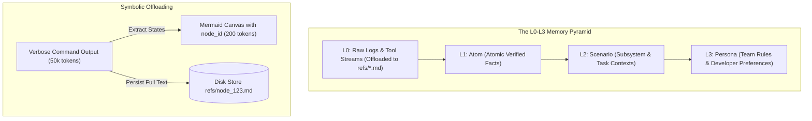
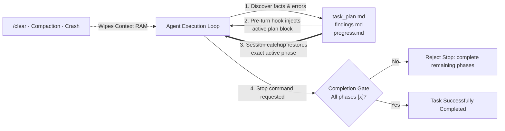

# Memory Engineering, Persistent Context & Cross-Session Recall for `minicode`

> **Comprehensive Research Report on State-of-the-Art Agent Memory Systems**  
> *Prepared for the `minicode` pure-Rust AI coding agent project*

---

## Executive Summary

State-of-the-art AI coding agents frequently suffer from **context window amnesia**, **information clutter**, **stale fact retention**, and **hallucinatory goal drift**. Traditional Retrieval-Augmented Generation (RAG) and flat vector stores fail to solve these issues because they lack semantic hierarchy, temporal awareness, biological decay, and deterministic grounding.

This report analyses eight leading projects spanning **cognitive memory architectures**, **progressive disclosure**, **symbolic execution offloading**, **filesystem-based planning**, and **pure-Rust native engines**:

1. **[Mem0](https://github.com/mem0ai/mem0)** — Dynamic Memory Layer & Knowledge Graphs
2. **[OpenMemory](https://github.com/CaviraOSS/OpenMemory)** — Multi-Sector Cognitive Engine & Temporal Waypoints
3. **[Claude-Mem](https://github.com/thedotmack/claude-mem)** — Non-Blocking Session Compaction & 3-Tier Progressive Disclosure
4. **[TencentDB Agent Memory](https://github.com/TencentCloud/TencentDB-Agent-Memory)** — Semantic Pyramids (L0–L3) & Mermaid Symbolic Canvas
5. **[Letta (MemGPT)](https://github.com/letta-ai/letta)** — OS Virtual Memory Hierarchy & Autonomous Self-Editing
6. **[Memory RS (openmemory_rs)](https://github.com/aswin402/memory_rs)** — Pure-Rust 6-Layer Engine, AST Graphs & Decay Math
7. **[Hubble.md](https://github.com/bholmesdev/hubble.md)** — File-First Human-Agent Shared Workspace & Live Markdown
8. **[Planning with Files](https://github.com/OthmanAdi/planning-with-files)** — Persistent 3-File Working Memory & Gated Task Completion

Following the individual analyses, this document outlines **Top 5 Actionable Ideas** tailored specifically for `minicode`'s minimalist, high-performance Pure Rust TUI + CLI architecture.

---

## Project Deep Dives

---

### 1. Mem0 (mem0ai/mem0)
* **Repository:** [https://github.com/mem0ai/mem0](https://github.com/mem0ai/mem0)
* **Primary Language:** Python / TypeScript

#### What It Does
Mem0 is a universal memory layer for AI agents and personalized assistants that dynamically extracts, deduplicates, updates, and retrieves structured user, session, and agent context across multi-turn interactions.

#### Key Technical Highlights
* **Hybrid Vector + Graph Memory**: Mem0 does not treat memory as raw unstructured chunks. It performs entity and relationship extraction to build an interconnected knowledge graph alongside a vector index.
* **Hierarchical Multi-Level Scoping**:
  * `user_id`: Global cross-session user preferences and personal traits.
  * `agent_id`: Agent persona, system constraints, and specialized instructions.
  * `run_id` / `session_id`: Ephemeral task-specific execution context.
  * `app_id`: Multi-tenant application isolation.
* **Memory CRUD & Dynamic Conflict Resolution**: Rather than naively appending all conversational turns to history, an LLM evaluator inspects incoming interactions against existing facts and executes atomic operations:
  * `ADD`: Insert new non-conflicting fact.
  * `UPDATE`: Modify an existing fact with newer details.
  * `DELETE`: Invalidate contradicted or revoked assertions.
  * `NOOP`: Ignore redundant or irrelevant chatter.
* **Storage Backend Adaptability**: Pluggable storage providers including Qdrant, Chroma, PGVector, Neo4j, Milvus, SQLite, and Memgraph.

#### Inspiration for `minicode`
* **Structured Memory Evaluation (Memory CRUD)**: When `minicode` finishes a task or receives user feedback, it should evaluate whether existing project memory needs an `ADD`, `UPDATE`, or `DELETE` rather than endlessly appending text. For example, if a user switches from `pnpm` to `bun`, `minicode` should update the project runbook rule rather than retaining conflicting commands.
* **Scoped Memory Partitions**: Partition `minicode`'s local state into `.minicode/global_memory.json` (developer-level preferences like editor configs, preferred CLI flags) and `.minicode/project_memory.json` (repository-specific architecture, build commands, test patterns).

#### Rust Crates / Dependencies Worth Noting
* `rusqlite` (with FTS5 & JSON1 for fast local relational storage).
* `petgraph` (in-memory directed graph for entity relations).
* `serde` / `serde_json` (structured fact serialization).

---

### 2. OpenMemory (CaviraOSS/OpenMemory)
* **Repository:** [https://github.com/CaviraOSS/OpenMemory](https://github.com/CaviraOSS/OpenMemory)
* **Primary Language:** TypeScript / Python

#### What It Does
OpenMemory is a local-first, self-hosted cognitive memory engine for AI agents that organizes memory into biological-inspired sectors with temporal reasoning, decay curves, and explainable recall traces.

#### Key Technical Highlights
* **Multi-Sector Memory Classification**:
  1. *Episodic*: Specific past events, conversation history, and chronological task executions.
  2. *Semantic*: General facts, world knowledge, code invariants, and domain rules.
  3. *Procedural*: Execution workflows, tool recipes, CLI syntax, and coding patterns.
  4. *Emotional*: User sentiment, satisfaction signals, feedback tone, and stylistic preferences.
  5. *Reflective*: High-level abstractions, meta-learnings, and post-task syntheses.
* **Temporal Knowledge Graph**:
  * Tracks `valid_from` and `valid_to` timestamps for every fact.
  * Supports point-in-time reasoning (e.g., "What was the database schema before Migration #4?").
  * Replaces destructive overwrites with historical versioning.
* **Biological Decay & Reinforcement Engine**:
  * Implements time-decay curves where memory salience decreases exponentially over time:
    $$S(t) = S_0 \cdot e^{-\lambda \Delta t}$$
  * Different sectors have distinct decay rates ($\lambda_{\text{episodic}} > \lambda_{\text{semantic}} > \lambda_{\text{procedural}}$).
  * Every time a memory node is recalled and successfully utilized, its salience $S_0$ is reinforced.
* **Waypoint Associative Retrieval & Explainability**:
  * Links co-activated memories through waypoint graphs.
  * Generates explainable recall traces showing *why* a specific memory was pulled into context.

```
       Incoming Query / Task
                 │
                 ▼
     ┌───────────────────────┐
     │   Waypoint Scanner    │
     └───────────┬───────────┘
                 │
  ┌──────────────┼──────────────┐
  ▼              ▼              ▼
┌──────────────┐ ┌────────────┐ ┌──────────────┐
│  Procedural  │ │  Semantic  │ │   Episodic   │
│  (Slow Decay)│ │ (Med Decay)│ │ (Fast Decay) │
└──────────────┘ └────────────┘ └──────────────┘
```

#### Inspiration for `minicode`
* **Sector-Specific Persistence**: `minicode` can store procedural knowledge (e.g., "how to run integration tests with Docker", "how to format code with taplo") with zero decay, while ephemeral episodic task logs (e.g., "fixed typo in line 42") decay and get compacted after 7 days.
* **Temporal Validity for Refactorings**: Track when architectural decisions are made so `minicode` doesn't apply stale patterns from old codebases after major refactors.

#### Rust Crates / Dependencies Worth Noting
* `chrono` (timestamp tracking and decay calculation).
* `petgraph` (waypoint graph traversals and associative hops).
* `small-world-rs` or `hnsw_rs` (fast in-process vector similarity search).

---

### 3. Claude-Mem (thedotmack/claude-mem)
* **Repository:** [https://github.com/thedotmack/claude-mem](https://github.com/thedotmack/claude-mem)
* **Primary Language:** TypeScript (Bun runtime)

#### What It Does
Claude-Mem is an automated persistent memory compression plugin for Claude Code and coding agents that captures tool execution streams, compresses them with AI workers into semantic observations, and injects context into future sessions via progressive disclosure.

#### Key Technical Highlights
* **Non-Blocking Hook Architecture**:
  * `UserPromptSubmit`: Pre-turn injection hook that queries memory and prepends relevant past context.
  * `PostToolExecution`: Captures tool inputs/outputs asynchronously in the background.
  * `SessionEnd` / Compaction Worker: Spawns an async worker that compresses verbose terminal transcripts into structured, atomic observations without blocking user interactivity.
* **3-Tier Progressive Disclosure Model**:
  1. *Tier 1 (System Prompt Summary)*: Ultra-compact index (< 200 tokens) loaded on startup summarizing major project themes and past sessions.
  2. *Tier 2 (Search Skill / `mem-search`)*: Agent-callable tool enabling on-demand semantic search over past observations.
  3. *Tier 3 (Granular ID Lookup / `get_observations`)*: Agent fetches full raw output of specific observation IDs only when detailed debugging evidence is needed.
* **Privacy Boundary Isolation**:
  * Supports `<private>...</private>` tags within prompts, files, and outputs to ensure API tokens, sensitive credentials, or proprietary files are excluded from persistent memory indexes.
* **Local SQLite Store & Web Viewer**:
  * Stores all session logs and observations in `~/.claude-mem/claude-mem.db`.
  * Hosts a lightweight local web dashboard for inspecting memory stream health.

#### Inspiration for `minicode`
* **Progressive Disclosure in the TUI**: Rather than dumping entire conversation histories into context, `minicode`'s TUI should initialize with a minimal `<memory_summary>` (Tier 1) and equip the agent with a built-in `search_memory` tool (Tier 2 & 3).
* **Asynchronous Background Compaction**: Use Tokio background tasks (`tokio::spawn`) to parse tool executions into SQLite observations immediately after each turn without adding latency to the interactive TUI prompt loop.
* **Privacy Tag Filter**: Implement a regex scrubber in `minicode` to automatically strip `<private>` tags and environment variable blocks (`.env`) before persisting memory.

#### Rust Crates / Dependencies Worth Noting
* `tokio` (background actor loops and asynchronous workers).
* `rusqlite` (bundled zero-config SQLite with WAL mode).
* `axum` / `warp` (optional lightweight embedded HTTP/WebSocket status server for web viewer).
* `regex` (privacy tag stripping).

---

### 4. TencentDB Agent Memory (TencentCloud/TencentDB-Agent-Memory)
* **Repository:** [https://github.com/TencentCloud/TencentDB-Agent-Memory](https://github.com/TencentCloud/TencentDB-Agent-Memory)
* **Primary Language:** TypeScript / Shell

#### What It Does
TencentDB Agent Memory is a team-level memory hub and context engine for AI agents that offloads heavy execution logs, structures long-term memory into an L0–L3 semantic pyramid, and condenses short-term state transitions into symbolic Mermaid canvases.

#### Key Technical Highlights
* **The L0–L3 Semantic Memory Pyramid**:
  * **L0: Conversation / Raw Logs**: Complete dialog and verbatim tool execution records, stored off-context in database or filesystem storage (`refs/*.md`).
  * **L1: Atom (Atomic Facts)**: Granular, verified assertions extracted from dialogues (e.g., "PostgreSQL runs on port 5433").
  * **L2: Scenario (Scene Blocks)**: Clustered atomic facts representing full task environments, project subsystems, or domain contexts.
  * **L3: Persona (Durable Profiles)**: High-level developer habits, project governance rules, and team conventions injected directly into working memory.
* **Symbolic Short-Term Memory (Mermaid Canvases)**:
  * Replaces thousands of tokens of intermediate compiler errors and search logs with a high-density Mermaid state transition diagram.
  * Embeds `node_id` references inside the Mermaid graph so agents can query the exact raw log on demand via `grep` or ID lookup.
  * **Benchmark Performance**: Reduces token consumption by **61.38%** while improving task pass rates by **51.52%** on long-horizon benchmarks.
* **Four Governed Memory Assets**:
  1. *Chat Memory*: Multi-turn dialogue history.
  2. *Skill*: Reusable executable agent SOPs and scripts.
  3. *LLM-Wiki*: Curated domain documentation and team knowledge.
  4. *Code-Graph*: AST-derived knowledge graph of repository symbols, callers, and dependencies.



#### Inspiration for `minicode`
* **Symbolic Tool Offloading**: When `minicode` runs commands with massive output (such as `cargo test --all`, `git log`, or compiler diagnostics with 500 lines of errors), it should write the full output to `.minicode/cache/refs/<id>.log` and inject a compact 5-line structural summary into context.
* **Code-Graph + Wiki Separation**: Store repository AST analysis in a dedicated `.minicode/code_graph.bin` cache, while keeping human-editable conventions in `.minicode/wiki/`.

#### Rust Crates / Dependencies Worth Noting
* `tree-sitter` & `tree-sitter-rust` (AST parsing and symbol extraction).
* `petgraph` (building caller-callee and symbol dependency graphs).
* `similar` (compact diff generation for symbolic state transitions).

---

### 5. Letta (formerly MemGPT) (letta-ai/letta)
* **Repository:** [https://github.com/letta-ai/letta](https://github.com/letta-ai/letta)
* **Primary Language:** Python / TypeScript

#### What It Does
Letta is an OS-inspired agent memory framework that models LLM context windows as hierarchical virtual memory, enabling agents to autonomously edit, page, search, and consolidate long-term memory across infinite conversational sessions.

#### Key Technical Highlights
* **Hierarchical Virtual Memory Architecture**:
  * **Core Memory (In-Context RAM)**: Fixed-token block injected into the system prompt containing two distinct sections:
    * `persona`: Instructions, tone, personality, and operational rules.
    * `human`: Key facts, preferences, and background of the user.
  * **Recall Memory (Conversation Paging)**: FIFO queue of recent message turns stored in a relational database, searchable via pagination functions.
  * **Archival Memory (Disk Storage)**: High-capacity vector database containing historical documents, past project summaries, and reference texts.
* **Autonomous Self-Editing Memory Tools**:
  * The agent itself controls what is remembered and forgotten via tool calling:
    * `core_memory_append(section, text)`
    * `core_memory_replace(section, old_text, new_text)`
    * `archival_memory_insert(content)`
    * `archival_memory_search(query, page)`
* **Memory Consolidation & Sleep Cycles**:
  * When working memory reaches capacity thresholds, background routines summarize conversational segments, extract key insights into Archival Memory, and free up context space.

#### Inspiration for `minicode`
* **Native System Prompt Core Memory Block**: Maintain an explicit, structured `<core_memory>` tag in `minicode`'s system prompt:
  ```markdown
  <core_memory>
  [project_invariants]
  - Rust Edition: 2024 (MSRV: 1.85)
  - Async Runtime: tokio (multi-thread)
  - TUI Library: ratatui 0.29
  [user_preferences]
  - Keep code changes minimal and idiomatic
  - Always run `cargo check` after edits
  </core_memory>
  ```
* **LLM Self-Editing Tool**: Provide `minicode` with a `save_project_rule(rule: String)` and `update_core_memory(...)` tool so the model can proactively record discoveries during exploration.

#### Rust Crates / Dependencies Worth Noting
* `tiktoken-rs` (strict token budgeting and bounds checking for core memory blocks).
* `rusqlite` (backing store for recall history and archival entries).
* `serde` (serialization of structured memory blocks).

---

### 6. Memory RS (openmemory_rs)
* **Repository:** [https://github.com/aswin402/memory_rs](https://github.com/aswin402/memory_rs)
* **Primary Language:** Pure Rust 🦀

#### What It Does
`openmemory_rs` is a high-performance, native Rust cognitive memory engine combining 6 memory layers (working context, knowledge graph, local vectors, episodic logs, AST code analysis, and subagent state sync) into an ultra-fast local server.

#### Key Technical Highlights
* **6 Cognitive Memory Layers**:
  1. *Working Layer*: Thread-safe `parking_lot::RwLock` RAM cache for sub-millisecond turn variables.
  2. *Graph Layer*: Directed entity-relationship graph utilizing `petgraph`, exposed via Model Context Protocol (MCP) and JSON-RPC.
  3. *Semantic Layer*: Pure local high-dimensional vector search using `fastembed` (ONNX Runtime) and cosine similarity.
  4. *Episodic Layer*: SQLite-persisted reflection logs and task post-mortems (tracking what failed, what succeeded, and why).
  5. *Code & AST Layer*: Tree-sitter powered codebase index tracking functions, structs, traits, call hierarchies, and refactoring history.
  6. *Shared Layer*: Cross-subagent state synchronization board for parallel agent swarms.
* **Multi-Factor Composite Relevance & Decay Equation**:
  $$\text{Relevance} = (\alpha \cdot \text{Similarity}) + (\beta \cdot \text{Recency}) + (\gamma \cdot \text{Importance}) + (\delta \cdot \text{SuccessRate})$$
  Where:
  $$\text{Recency} = e^{-\lambda (t_{\text{now}} - t_{\text{event}})}$$
  $$\text{Importance} \in [0.0, 1.0], \quad \text{SuccessRate} = \frac{\text{Successful Invocations}}{\text{Total Invocations}}$$
* **Pure Rust Architecture**: Zero Python or external daemon dependencies. Embeds SQLite directly with `rusqlite` (bundled) and ONNX models via `ort` / `fastembed`.

```
                    ┌───────────────────────────────────────────┐
                    │            Memory Coordinator             │
                    └─────────────────────┬─────────────────────┘
                                          │
       ┌──────────────────┬───────────────┼───────────────┬──────────────────┐
       ▼                  ▼               ▼               ▼                  ▼
┌──────────────┐   ┌──────────────┐ ┌───────────┐ ┌───────────────┐   ┌──────────────┐
│Working Memory│   │ Graph Memory │ │  Semantic │ │Episodic Memory│   │Codebase Memory│
│(RwLock RAM)  │   │  (Petgraph)  │ │(FastEmbed)│ │ (SQLite Logs) │   │(Tree-Sitter) │
└──────────────┘   └──────────────┘ └───────────┘ └───────────────┘   └──────────────┘
```

#### Inspiration for `minicode`
* **Direct Rust Native Engine Integration**: Since `openmemory_rs` is written in Rust, `minicode` can directly adopt its internal architectures, data models, and crate configurations without translation barriers.
* **Tree-Sitter Codebase Symbol Indexing**: Integrate `tree-sitter-rust` and `petgraph` directly into `minicode`'s indexing pipeline to enable instant definition lookup and caller-callee relationship navigation during code edits.
* **Math-Based Context Ranking**: Adopt the composite relevance formula in `minicode`'s memory retriever to balance semantic similarity against recency and past success rates.

#### Rust Crates / Dependencies Worth Noting
* `rusqlite = { version = "0.32", features = ["bundled"] }` (zero external dependencies).
* `petgraph = "0.6"` (graph representation and traversals).
* `tree-sitter = "0.24"` & language parsers (`tree-sitter-rust`, `tree-sitter-python`, `tree-sitter-typescript`).
* `fastembed = "4.9"` (local in-process embeddings without cloud API calls).
* `parking_lot = "0.12"` (fast synchronization primitives).
* `rmcp = "0.16"` (Rust Model Context Protocol server).

---

### 7. Hubble.md (bholmesdev/hubble.md)
* **Repository:** [https://github.com/bholmesdev/hubble.md](https://github.com/bholmesdev/hubble.md)
* **Primary Language:** TypeScript (Electron + Tiptap)

#### What It Does
Hubble.md is a free, open-source collaborative notepad for humans and AI agents backed entirely by plain Markdown and HTML files on the local filesystem, enabling real-time live-reloading and co-editing.

#### Key Technical Highlights
* **File-First Plain Markdown Storage**:
  * Rejects opaque binary databases in favor of standard `.md` files with YAML frontmatter.
  * Every note, rule, and agent finding is human-readable, git-trackable, and editable with standard terminal tools.
* **Agent-Ready Live Reloading**:
  * File watchers monitor note directories for external agent modifications and live-reload the UI without user intervention.
* **Extensible HTML Views & Interactive Apps**:
  * Agents can generate dynamic HTML apps, tables, or kanban boards embedded directly in markdown workspaces.
* **Zero Infrastructure Overhead**:
  * Works completely offline out-of-the-box using the local disk.

#### Inspiration for `minicode`
* **Git-Trackable Project Memory (`.minicode/`)**: Store repository-level memories and developer runbooks as clean, formatted Markdown files inside `.minicode/` (e.g., `.minicode/rules.md`, `.minicode/architecture.md`).
* **Live Filesystem Synchronization**: Use the Rust `notify` crate in `minicode` to watch `.minicode/*.md` files; if the developer edits `rules.md` in another terminal or editor, `minicode` hot-reloads the context dynamically during active sessions.

#### Rust Crates / Dependencies Worth Noting
* `notify` (cross-platform filesystem event watching for hot-reloading).
* `pulldown-cmark` (ultra-fast, zero-allocation CommonMark parser).
* `gray_matter` or `serde_yaml` (YAML frontmatter parsing for markdown memory files).

---

### 8. Planning with Files (OthmanAdi/planning-with-files)
* **Repository:** [https://github.com/OthmanAdi/planning-with-files](https://github.com/OthmanAdi/planning-with-files)
* **Primary Language:** Markdown / Shell / JavaScript

#### What It Does
Planning with Files is a persistent working-memory architecture for AI coding agents that maintains 3 stone-tablet markdown files on disk (`task_plan.md`, `findings.md`, `progress.md`) to survive context loss, `/clear`, crashes, and window compaction.

#### Key Technical Highlights
* **The 3-Stone-Tablets Working Memory Pattern**:
  1. `task_plan.md`: High-level roadmap, task phases, execution checklists (`[ ]` vs `[x]`), active focus, and key decisions.
  2. `findings.md`: Ground truth discovered during exploration, file paths, API contracts, architectural constraints, and gotchas.
  3. `progress.md`: Chronological execution log, test suite results, and immediate next steps.
* **Manus-Style Disk Working Memory**:
  $$\text{Context Window} = \text{RAM (Volatile, Limited)}, \quad \text{Filesystem} = \text{Disk (Persistent, Unlimited)}$$
  Anything critical to the task is written to disk immediately rather than held only in conversational memory.
* **Session Recovery & Catchup Algorithm**:
  * When a session crashes or a user issues `/clear`, lifecycle hooks re-read the 3 files on disk and generate a deterministic catchup block (`===BEGIN PLAN DATA===`), resuming execution at the exact phase in 5 turns instead of 13.3 turns.
* **Gated Task Completion (Stop-Gate)**:
  * Implements an opt-in completion gate (`check-complete.sh`) that intercepts the agent's stop signal and verifies that all phases in `task_plan.md` have been checked off before allowing task completion.



#### Inspiration for `minicode`
* **Native 3-File Multi-Turn Planner**: Integrate the 3-file pattern directly into `minicode`'s long-running agent workflows (stored in `.minicode/plan/` or workspace root).
* **TUI Plan Visualizer**: Render an active status widget in `minicode`'s Ratatui interface showing the current phase from `task_plan.md` and progress checklist directly in the terminal header.
* **Pre-Turn Plan Re-Injection**: At the start of every LLM turn, inject a compact 3-line header (`=== ACTIVE TASK: Phase 2/4 | Next: Add tests ===`) extracted from `task_plan.md`.
* **Completion Verification Gate**: Prevent `minicode` from prematurely declaring task completion until automated verification checks (e.g. `cargo check`, test assertions) pass.

#### Rust Crates / Dependencies Worth Noting
* `tokio::fs` (fast asynchronous markdown file reads/writes).
* `regex` (parsing markdown checklist items `[ ]` and `[x]`).
* `ratatui` (rendering interactive task plan progress bars and phase trees in the TUI).

---

## Architectural Comparison Matrix

| Project | Storage Model | Memory Classification | Retrieval Paradigm | Dynamic Self-Editing | Offline / Pure Rust |
| :--- | :--- | :--- | :--- | :--- | :--- |
| **Mem0** | Vector DB + Graph DB | User, Agent, Session, App | Vector + Graph Search | ✅ Automatic (LLM CRUD) | ❌ Python/TS, needs DBs |
| **OpenMemory** | SQLite / Postgres | Episodic, Semantic, Procedural, Emotional, Reflective | Waypoint Graph + Composite Decay Score | ✅ Decay & Reinforcement | ❌ Python/TS |
| **Claude-Mem** | SQLite (`~/.claude-mem.db`) | Observations & Sessions | 3-Tier Progressive Disclosure | ✅ Background Compactor | ❌ TS (Bun), Chroma/uv |
| **TencentDB Memory** | Database + Markdown | L0–L3 Semantic Pyramid | Symbolic Mermaid + `node_id` Drilldown | ✅ Distillation Pipeline | ❌ TS/Shell |
| **Letta (MemGPT)** | SQLite / Vector DB | Core, Recall, Archival | OS Virtual Memory Paging | ✅ Agent Tool Calling | ❌ Python/TS |
| **Memory RS** | SQLite + Petgraph | 6 Cognitive Layers (RAM, Graph, Vector, AST, Episodic, Shared) | Multi-Factor Score: $(\alpha\text{Sim} + \beta\text{Rec} + \gamma\text{Imp} + \delta\text{Succ})$ | ✅ Local SQLite Logs | ✅ **Pure Rust** 🦀 |
| **Hubble.md** | Local Markdown Files | Plain Notes & HTML Apps | Direct Filesystem & Search | ⚠️ File Edits | ❌ Electron/TS |
| **Planning with Files** | 3 Markdown Files | `task_plan`, `findings`, `progress` | Turn-by-Turn Re-Injection | ✅ Hook-driven disk updates | ✅ Shell/agnostic |

---

## Top 5 Actionable Ideas for `minicode`'s Memory Subsystem

Based on the technical patterns extracted across all 8 projects, here is the recommended blueprint for `minicode`'s memory architecture.

```
┌─────────────────────────────────────────────────────────────────────────────────┐
│                           minicode Context Engine                               │
├─────────────────────────────────────────────────────────────────────────────────┤
│                                                                                 │
│   ┌─────────────────────────────────────────────────────────────────────────┐   │
│   │ Tier 0: In-Context Core Memory (<core_memory> System Prompt Block)      │   │
│   │ • User preferences • Active project invariants (MSRV, toolchain)        │   │
│   └────────────────────────────────────┬────────────────────────────────────┘   │
│                                        │                                        │
│   ┌────────────────────────────────────▼────────────────────────────────────┐   │
│   │ Tier 1: Working Filesystem Plan (.minicode/plan/*.md)                   │   │
│   │ • task_plan.md • findings.md • progress.md (Manus-style Disk Memory)    │   │
│   └────────────────────────────────────┬────────────────────────────────────┘   │
│                                        │                                        │
│   ┌────────────────────────────────────▼────────────────────────────────────┐   │
│   │ Tier 2: Codebase AST & Symbol Graph (Tree-Sitter + Petgraph)             │   │
│   │ • Symbol definitions • Caller-callee relations • Fast in-RAM resolution │   │
│   └────────────────────────────────────┬────────────────────────────────────┘   │
│                                        │                                        │
│   ┌────────────────────────────────────▼────────────────────────────────────┐   │
│   │ Tier 3: Archival Memory & Execution Offloading (SQLite FTS5 + refs/)    │   │
│   │ • Episodic task history • Offloaded tool output refs/ • Decay scoring   │   │
│   └─────────────────────────────────────────────────────────────────────────┘   │
│                                                                                 │
└─────────────────────────────────────────────────────────────────────────────────┘
```

---

### 1. Hybrid 3-Tier Progressive Disclosure Architecture
* **Design**:
  * **Tier 0 (In-Context RAM)**: Embed a concise `<core_memory>` block in the system prompt (~200 tokens) holding developer rules and repository invariants.
  * **Tier 1 (Filesystem Working Memory)**: For multi-step tasks, create `.minicode/plan/{task_plan.md, findings.md, progress.md}` on disk. Prepend a 3-line active task status banner into each prompt turn. Survives `/clear`, restarts, and compaction.
  * **Tier 2 (Searchable Archival Memory)**: Store past session post-mortems and historical project lessons in a local SQLite database (`.minicode/memory.db`). Expose a built-in `search_memory` tool for the LLM to query on demand.
* **Why for minicode**: Keeps context windows lean and token costs low while preserving 100% of historical context across sessions.

---

### 2. AST-Aware Codebase Graph & Symbol Memory (Tree-Sitter + Petgraph)
* **Design**:
  * Parse codebase files on project initialization using `tree-sitter` (supporting Rust, TypeScript/JavaScript, Python, Go, C/C++).
  * Construct an in-memory directed graph using `petgraph` linking structs, functions, traits, modules, and caller-callee references.
  * When an agent plans edits or refactors, query the graph to resolve dependencies instantly without needing broad full-text keyword searches.
* **Why for minicode**: Leverages Rust's native performance for instant symbol lookups, preventing hallucinations during cross-file refactoring.

---

### 3. Symbolic Context Offloading for Verbose Tool Outputs
* **Design**:
  * When terminal commands or tool outputs exceed a token threshold (e.g. > 1,000 tokens for compiler outputs, test runners, or `git diff`), offload the full text to `.minicode/cache/refs/<hash>.log`.
  * Inject a compact 5-line structural summary into context:
    ```markdown
    [Command: `cargo test` exited with code 101]
    - Passed: 42 tests
    - Failed: 2 tests (tests::test_parser, tests::test_eval)
    - Full log offloaded: .minicode/cache/refs/ref_9a8f2c.log
    (Use tool `view_log_ref("ref_9a8f2c")` to inspect detailed failure backtraces)
    ```
* **Why for minicode**: Cuts token usage by 50–70% on long coding loops, prevents context bloat, and preserves full traceability.

---

### 4. Mathematical Relevance Ranking with Sector Decay
* **Design**:
  * Rank archival memories using a composite scoring formula:
    $$\text{Score} = (\alpha \cdot \text{BM25/CosineSimilarity}) + (\beta \cdot e^{-\lambda \Delta t}) + (\gamma \cdot \text{Importance}) + (\delta \cdot \text{SuccessRate})$$
  * Partition memories into sectors with custom decay constants:
    * *Episodic* (task logs): $\lambda = 0.1$ (decays rapidly over days).
    * *Semantic* (architecture rules): $\lambda = 0.001$ (persists long-term).
    * *Procedural* (build & test commands): $\lambda = 0.0$ (permanent, reinforced on use).
* **Why for minicode**: Ensures old debugging scratch notes naturally fade while critical architectural constraints stay permanently retrievable.

---

### 5. Autonomous Memory Self-Editing (LLM Memory CRUD Tools)
* **Design**:
  * Equip `minicode` with native memory tools:
    * `remember_fact(category, topic, fact)`
    * `update_fact(id, new_fact)`
    * `forget_fact(id)`
    * `search_memory(query, category)`
  * Implement `valid_from` and `valid_to` timestamps in SQLite. When an agent discovers that a project dependency has been replaced or a convention updated, it marks the old rule as expired and inserts the new one.
* **Why for minicode**: Prevents knowledge contradictions over time, sparing the user from repeatedly re-explaining the same project conventions.

---

## Recommended Rust Crate Ecosystem for `minicode`

To implement these memory capabilities in pure Rust without external services, the following crates are recommended:

| Crate | Purpose in `minicode` |
| :--- | :--- |
| **`rusqlite`** (`features = ["bundled"]`) | Zero-dependency, embedded SQLite storage for Tier 2/3 archival memory, observations, and temporal validity logs. |
| **`petgraph`** | In-memory directed graph for AST caller-callee relations and waypoint associative indexing. |
| **`tree-sitter`** + language parsers | Fast AST parsing of project files (Rust, Python, TS/JS, Go) for symbol extraction. |
| **`tokio`** (`features = ["full"]`) | Asynchronous background workers for non-blocking tool offloading and memory compaction. |
| **`notify`** | Filesystem watcher for live-reloading `.minicode/plan/` and `.minicode/rules.md` when modified externally. |
| **`tiktoken-rs`** | Fast token counting and budgeting for `<core_memory>` and prompt context assembly. |
| **`ratatui`** | Terminal UI components for displaying active task plan phases, memory health, and search results. |
| **`similar`** | Zero-dependency text and diff generation for structural summaries and state transitions. |
| **`serde`** / **`serde_json`** | Serialization of structured facts, plans, and memory configuration files. |
| **`chrono`** | Timestamp arithmetic for calculating exponential memory decay curves ($e^{-\lambda \Delta t}$). |

---
*Document compiled for `minicode` architecture planning.*
