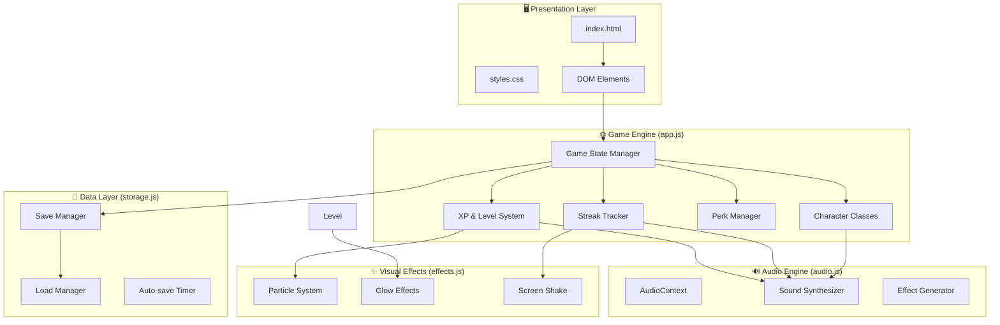
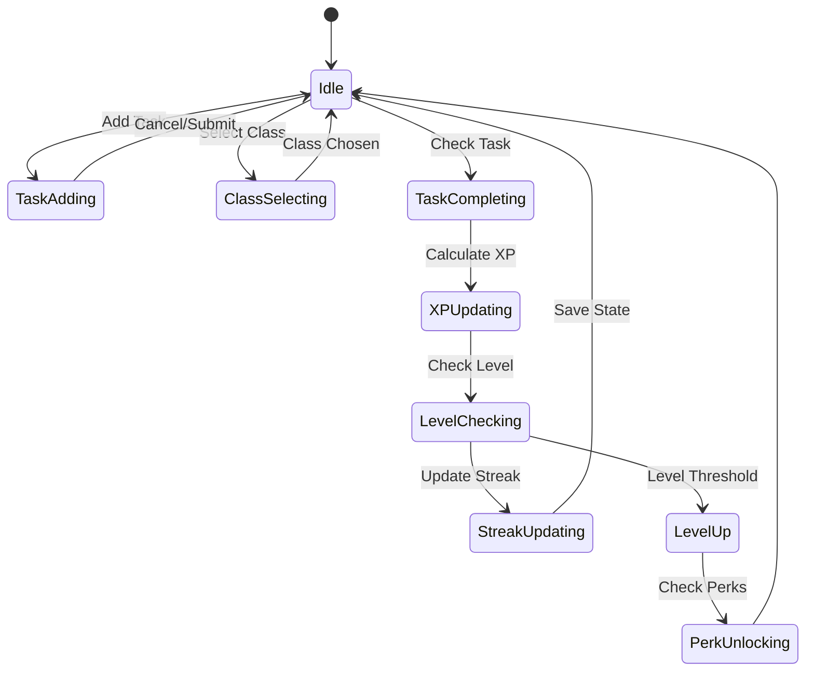

# 🏛️ Architecture Documentation: QuestDo Gamified Todo RPG

> *Architecture for gamified productivity app with RPG mechanics*

## 📊 System Overview
- **Project:** QuestDo - Gamified Todo RPG Game
- **Type:** Single-page browser application (SPA)
- **Runtime:** Vanilla JavaScript + HTML5 + Web Audio API
- **Storage:** localStorage for persistence
- **Total Files:** 6 modular components

---

## 📐 Clean Architecture Layers

| Layer | Files | Responsibility |
|-------|-------|----------------|
| **UI/Presentation** | `index.html`, `styles.css` | DOM rendering, animations, visual effects |
| **Application/Game** | `app.js` | Game state, XP logic, leveling, streak management |
| **Audio Engine** | `audio.js` | Web Audio API procedural synthesis |
| **Data/Persistence** | `storage.js` | localStorage read/write, save/load |
| **Utilities** | `effects.js` | Particle systems, visual celebrations |

---

## 🗺️ Component Architecture



---

## 🔑 Core Class Design

### GameState
```javascript
{
    character: { class, stats, name },
    xp: { current, total, level },
    streak: { current, longest, lastCompletedDate },
    perks: [unlockedPerkIds],
    tasks: [{ id, text, difficulty, completed, createdAt }]
}
```

### Character Classes
| Class | STR | INT | AGI | Passive |
|-------|-----|-----|-----|---------|
| Warrior | 15 | 8 | 10 | +20% XP (hard/epic) |
| Mage | 8 | 15 | 10 | +1 XP per level |
| Rogue | 10 | 10 | 15 | +10% streak bonus |

### XP Scaling Formula
```
XP for Level N = floor(100 * 1.5^(N-1))
Total XP needed for Level N = sum of all previous levels
```

---

## 🎮 State Machine



---

## 🔊 Audio Architecture

### Web Audio Graph
```
┌──────────────┐    ┌──────────┐    ┌─────────┐    ┌───────────┐
│ Oscillator   │───▶│ GainNode │───▶│ Filter  │───▶│ destination│
│ (Waveform)   │    │ (Volume) │    │ (Biquad)│    │           │
└──────────────┘    └──────────┘    └─────────┘    └───────────┘
```

### Sound Events
| Event | Frequency | Waveform | Duration | Envelope |
|-------|-----------|----------|----------|----------|
| taskComplete | 523→1047 Hz | sine | 150ms | Attack 10ms, Decay 140ms |
| levelUp | C4-E4-G4 | triangle | 800ms | Staggered arpeggio |
| streak7 | 440 Hz sweep | sawtooth | 300ms | Filter sweep down |
| streak14 | 880 Hz burst | square | 400ms | Chord burst |
| achievement | 2093 Hz | sine | 200ms | Crystal reverb |

---

## ✨ Visual Effects Architecture

### Particle System
- **Pool size:** 50 particles max
- **Physics:** Velocity + gravity + friction
- **Colors:** Contextual (gold=XP, green=task, orange=streak, rainbow=achievement)

### Animation Keyframes
| Effect | Duration | Properties |
|--------|----------|------------|
| taskPulse | 300ms | scale 1→1.2→1, green glow |
| levelGlow | 1000ms | radial gradient, golden flash |
| confetti | 2000ms | random trajectory, rotation, fade |
| streakFire | continuous | flame particles on counter |

---

## 💾 Data Persistence

### localStorage Schema
```json
{
    "questdo_save": {
        "version": "1.0",
        "character": {...},
        "xp": {...},
        "streak": {...},
        "perks": [...],
        "tasks": [...],
        "lastSave": "ISO timestamp"
    }
}
```

### Auto-save Triggers
1. After every task completion
2. After level up
3. After streak update
4. Every 30 seconds (idle save)

---

## 🔗 File Dependencies

```
index.html
├── styles.css
├── app.js
│   ├── audio.js
│   ├── effects.js
│   └── storage.js
└── No external CDN dependencies
```

All files are self-contained with zero external assets (no images, audio files, or fonts loaded externally).
